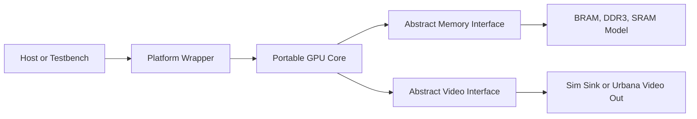

# UrbanaGPU-1

UrbanaGPU-1 is a small custom GPU-like graphics accelerator written in clean,
portable SystemVerilog RTL.

The first hardware target is the RealDigital Urbana FPGA board. The project
uses the board as a development platform while keeping the GPU core separate
from Urbana, AMD/Xilinx, Vivado, DDR3, and video-output integration details.

## Version 1 Goal

Build a minimal hardware graphics pipeline that can:

- accept a small command stream
- clear a framebuffer
- draw filled rectangles
- display a 160x120 RGB565 framebuffer scaled to 640x480
- run in simulation and on the Urbana board

## Design Split



The portable core lives under `rtl/`. Board-specific integration lives under
`platform/urbana/`. Simulation and future ASIC integration layers live beside
the Urbana wrapper rather than inside the GPU core.

## Documentation

Start with [docs/index.md](docs/index.md). It is the canonical table of
contents for the reorganized documentation tree.

Primary entry points:

- [Architecture](docs/architecture/architecture.md)
- [Programming model](docs/architecture/programming_model.md)
- [ISA](docs/architecture/isa.md)
- [Core architecture](docs/architecture/core_architecture.md)
- [Roadmap](docs/implementation/roadmap.md)
- [Verification plan](docs/verification/verification_plan.md)
- [FPGA bring-up](docs/platform/fpga_bringup.md)

## Current Status

The repository contains the portable RTL scaffold, a programmable SIMD core
path, kernel-level simulations, formal proofs for selected control/datapath
blocks including the clear engine, scheduler sticky-error behavior, special
register mux, LSU prep, and request/response sequencing, draw-unit corner
coverage for command/clear/rectangle/framebuffer paths, command-driven
`STORE16` and `vector_add` kernel coverage through `gpu_core`, and Yosys
synthesis smoke coverage for leaf blocks and the integrated programmable core
path.
Illegal instruction, illegal special-register, branch, memory, and predicated
store integration tests cover the current programmable path, including
convergent taken/not-taken branches, signed backward branches, R0 predicates,
and divergent branch faults. Normal integration-test kernels now use a
testbench-only mnemonic helper package instead of raw ISA constructors;
malformed illegal-instruction fixtures still hand-build invalid encodings on
purpose. The helper package is not a full assembler or C toolchain. An optional
Vivado synthesis smoke target is present for FPGA-facing checks once Vivado and
the target part name are available.

## Toolchain Check

```text
make check-tools
make tool-versions
make sim
make lint
make formal
make synth-yosys
```

Optional FPGA synthesis smoke:

```text
VIVADO_PART=<xilinx-part-name> make synth-vivado
```
