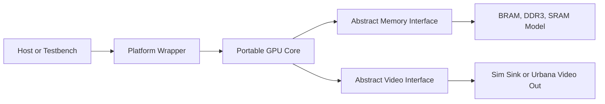

# UrbanaGPU-1

UrbanaGPU-1 is a small custom GPU-like graphics accelerator written in clean,
portable SystemVerilog RTL.

The first hardware target is the RealDigital Urbana FPGA board. The project
uses the board as a development platform while keeping the GPU core separate
from Urbana, AMD/Xilinx, Vivado, DDR3, and video-output integration details.

## Version 1 Goal

Build a minimal hardware graphics pipeline that can:

- accept a small command stream
- clear a framebuffer
- draw filled rectangles
- display a 160x120 RGB565 framebuffer scaled to 640x480
- run in simulation and on the Urbana board

## Design Split



The portable core lives under `rtl/`. Board-specific integration lives under
`platform/urbana/`. Simulation and future ASIC integration layers live beside
the Urbana wrapper rather than inside the GPU core.

## Documentation

Start with [docs/index.md](docs/index.md). It is the canonical table of
contents for the reorganized documentation tree.

Primary entry points:

- [Architecture](docs/architecture/architecture.md)
- [Programming model](docs/architecture/programming_model.md)
- [ISA](docs/architecture/isa.md)
- [Command and kernel lifecycle](docs/architecture/command_kernel_lifecycle.md)
- [Kernel ABI](docs/architecture/kernel_abi.md)
- [Core architecture](docs/architecture/core_architecture.md)
- [Roadmap](docs/implementation/roadmap.md)
- [Verification plan](docs/verification/verification_plan.md)
- [Regression debug](docs/verification/regression_debug.md)
- [FPGA bring-up](docs/platform/fpga_bringup.md)

## Current Status

The repository contains the portable RTL scaffold, a programmable SIMD core
path, kernel-level simulations, formal proofs for selected control/datapath
blocks including the clear engine, scheduler sticky-error behavior, special
register mux, LSU prep, and request/response sequencing, draw-unit corner
coverage for command/clear/rectangle/framebuffer paths, command-driven
`STORE16`, `vector_add`, nonzero `PROGRAM_BASE`, and 2D framebuffer-gradient
kernel coverage through `gpu_core`, command-driven stalled/delayed memory
smoke, host-visible `STORE16` fault coverage, soft-reset recovery smoke,
memory-arbiter identity/routing coverage, round-robin arbitration leaf coverage,
portable video timing and framebuffer scanout unit coverage, arbiter-backed `gpu_core` memory
request routing, top-level memory request/response IDs, in-order response tracking, and Yosys synthesis smoke
coverage for leaf blocks and the integrated programmable core path. Top-level command-kernel fault coverage checks that an LSU-detected
programmable fault reaches host-visible status without issuing a memory write.
Command-level response-ID reorder coverage returns a programmable LSU response
before older fixed-function writer responses and verifies routing by
`mem_rsp_id`.
Illegal instruction, illegal special-register, branch, memory, and predicated
store integration tests cover the current programmable path, including
convergent taken/not-taken branches, signed backward branches, R0 predicates,
and divergent branch faults. Normal integration-test kernels now use a
host-side assembler and checked `.kgpu`/`.memh` fixtures across command-level
`gpu_core` and lower-level programmable-core flows. Directed malformed
illegal-instruction tests use checked `.word` raw fixtures. The assembler is
not a C compiler or stable C ABI. An optional Vivado synthesis smoke target is
present for FPGA-facing checks once Vivado and the target part name are
available.

The command-driven kernel ABI is current RTL behavior: `PROGRAM_BASE` is an
instruction-word offset, `GRID_X` and `GRID_Y` define the work-item rectangle,
the only supported group size is `4x1`, `ARG_BASE` points at a global-memory
argument block, and `LAUNCH_FLAGS` must be zero.

## Toolchain Check

```text
make check-tools
make tool-versions
make sim
make lint
make formal
make synth-yosys
make regress
```

For targeted simulation debug:

```text
make list-sim-tests
SIM_TEST=tb_gpu_core_command_vector_add SIM_TRACE=1 make sim
SIM_GLOB='*load_store*' make sim
```

Optional FPGA synthesis smoke:

```text
VIVADO_PART=<xilinx-part-name> make synth-vivado
```

Use `VIVADO_DRY_RUN=1 VIVADO_PART=<xilinx-part-name> make synth-vivado`
without Vivado installed to validate the Vivado source manifest and Tcl path.
