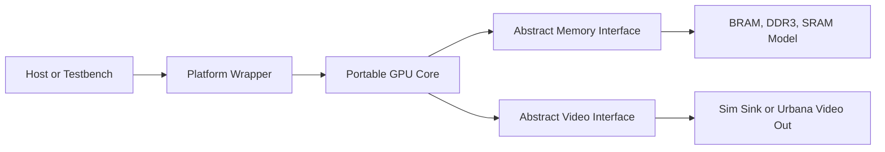

# UrbanaGPU-1

UrbanaGPU-1 is a small custom GPU-like graphics accelerator written in clean,
portable SystemVerilog RTL.

The first hardware target is the RealDigital Urbana FPGA board. The project
uses the board as a development platform while keeping the GPU core separate
from Urbana, AMD/Xilinx, Vivado, DDR3, and video-output integration details.

## Version 1 Goal

Build a minimal hardware graphics pipeline that can:

- accept a small command stream
- clear a framebuffer
- draw filled rectangles
- display a 160x120 RGB565 framebuffer scaled to 640x480
- run in simulation and on the Urbana board

## Design Split

The portable core lives under `rtl/`. Board-specific integration lives under
`platform/urbana/`. Simulation and future ASIC integration layers live beside
the Urbana wrapper rather than inside the GPU core.

## Documentation

Start with [docs/index.md](docs/index.md).

Key documents:

- [Project plan](docs/project_plan.md)
- [Architecture](docs/architecture.md)
- [Design boundaries](docs/design_boundaries.md)
- [Target platform](docs/target_platform.md)
- [Command format](docs/command_format.md)
- [Memory map](docs/memory_map.md)
- [Memory system](docs/memory_system.md)
- [Video pipeline](docs/video_pipeline.md)
- [Verification plan](docs/verification_plan.md)
- [FPGA bring-up](docs/fpga_bringup.md)
- [ASIC portability](docs/asic_portability.md)
- [Version 1 scope](docs/version_1_scope.md)

## Current Status

This repository currently contains the project scaffold and design
documentation. RTL implementation comes next.
