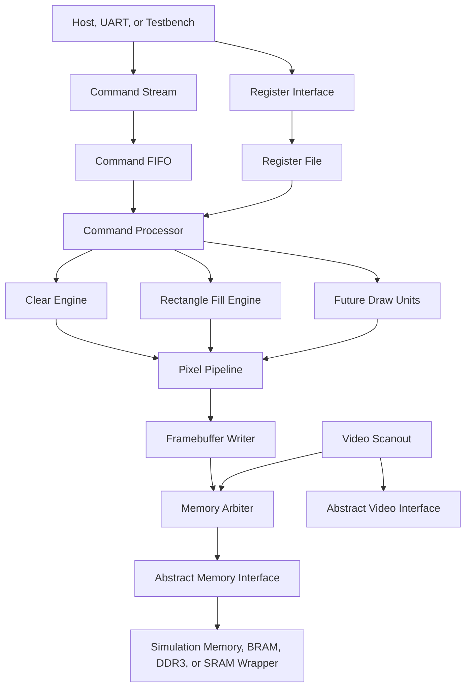

# Architecture

UrbanaGPU-1 is a command-driven 2D graphics accelerator. It receives compact
commands, dispatches them to draw units, writes pixels into a framebuffer, and
scans the framebuffer to video output.

The architecture intentionally starts small. The first implementation favors
observable correctness over throughput.

## Block Diagram



## Primary Data Paths

### Command Path

Commands enter through a host-visible command FIFO. The command processor
decodes command words, checks packet length, validates arguments where possible,
and starts the selected draw unit.

The command processor is not allowed to write pixels directly. It dispatches
work to draw units so each graphics operation can be tested independently.

### Pixel Path

Draw units generate pixel write requests:

```text
x
y
color
valid
ready
```

The pixel pipeline applies shared rules such as bounds checks, optional clip
rectangles, format conversion, and write coalescing in later versions.

### Memory Path

The framebuffer writer converts pixel coordinates into byte addresses and emits
abstract memory writes. The memory arbiter decides which client gets access to
the memory interface in a given cycle.

The GPU core never assumes whether memory is simulation RAM, FPGA BRAM, DDR3,
or ASIC SRAM.

### Video Path

The video scanout module reads framebuffer pixels in display order and emits a
portable video stream. The Urbana video wrapper converts that stream into the
board-specific output.

## Initial Clocking Assumption

Version 1 uses one synchronous domain:

```text
gpu_clk
reset_sync
```

The goal is to remove avoidable CDC complexity until the core behavior is
proven in simulation and on hardware.

## Core Module Responsibilities

| Module | Responsibility |
| --- | --- |
| `gpu_core.sv` | Top-level portable core integration. |
| `gpu_pkg.sv` | Shared parameters, enums, packed structs, and constants. |
| `command_processor.sv` | Command decode, sequencing, error handling, dispatch. |
| `register_file.sv` | Host-visible control and status registers. |
| `command_fifo.sv` | Buffered command ingress. |
| `clear_engine.sv` | Full-frame color fill. |
| `rect_fill_engine.sv` | Clipped filled rectangles. |
| `pixel_pipeline.sv` | Pixel validation and shared write path. |
| `framebuffer_writer.sv` | Pixel-to-address translation and memory writes. |
| `video_scanout.sv` | Framebuffer readout and scaled display coordinates. |
| `memory_arbiter.sv` | Memory client arbitration. |

## Design Invariants

- The core has no direct vendor primitive instantiations.
- Draw units use explicit start, busy, done, and error signaling.
- Memory clients use valid/ready handshakes.
- Command execution is deterministic for a given command stream.
- Reset leaves the core in an idle, non-writing state.
- The first framebuffer format is RGB565.

## Error Model

Errors are sticky until cleared by software. Version 1 should report at least:

- unknown command opcode
- malformed command packet
- command FIFO overflow
- unsupported framebuffer format
- draw command issued with invalid dimensions

The core may safely ignore impossible pixels after clipping. A clipped rectangle
outside the framebuffer is not an error; it is a valid no-op.
