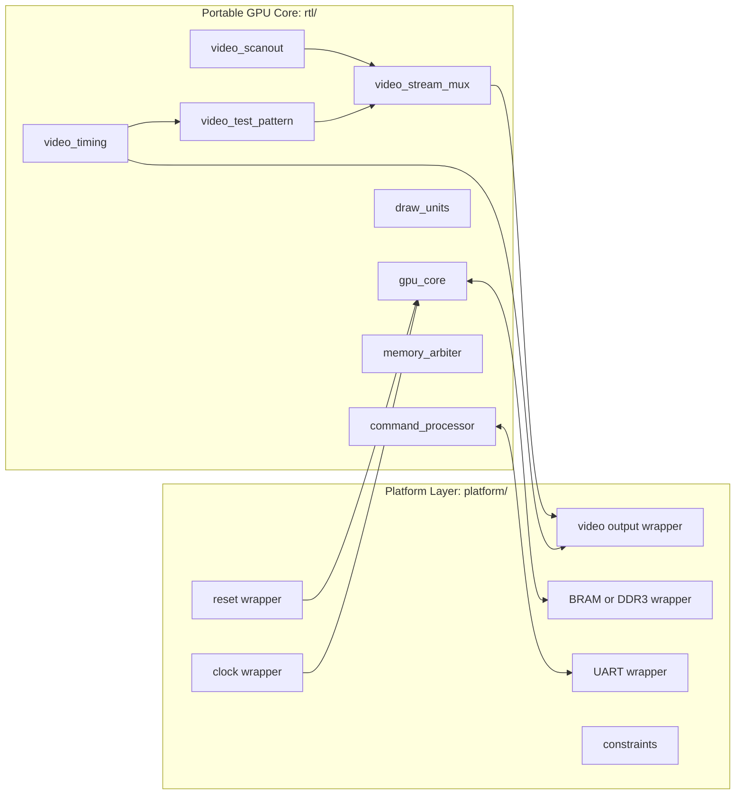

# Design Boundaries

The repository is divided into portable GPU RTL and platform integration. This
boundary is the most important architectural rule in the project.

## Boundary Diagram



## Portable RTL

Portable RTL lives in:

```text
rtl/core/
rtl/draw_units/
rtl/interfaces/
rtl/common/
```

Portable RTL may contain:

- synthesizable SystemVerilog
- packages, typedefs, enums, and parameters
- inferred registers and simple inferred memories
- explicit valid/ready interfaces
- assertions that work in simulation and lint flows

Portable RTL must not contain:

- Xilinx or AMD primitive instances
- Vivado IP core instances
- board pin names
- Urbana-specific clock names
- DDR3 controller signals
- HDMI encoder internals
- assumptions about FPGA register initialization

## Platform RTL

Platform-specific integration lives in:

```text
platform/urbana/
platform/sim/
platform/asic/
```

The platform layer may contain:

- clock generation
- reset conditioning
- UART bridge logic
- video-output conversion
- DDR3 controller integration
- BRAM wrappers
- board pin constraints
- simulation-only memory and video sinks
- ASIC wrapper stubs

## Interface Contract

The core talks to the platform through documented interfaces only:

| Interface | Direction | Purpose |
| --- | --- | --- |
| Command input | Platform to core | Push command words into the command FIFO. |
| Register access | Platform to core | Read and write control/status registers. |
| Memory request | Core to platform | Read/write framebuffer and resource memory. |
| Memory response | Platform to core | Return read data for scanout and future fetchers. |
| Video stream | Core to platform | Emit active pixels and timing metadata. |

## Review Checklist

Before adding RTL under `rtl/`, check:

- Does it build without Urbana files?
- Does it simulate with `platform/sim/` wrappers?
- Does it avoid vendor primitive names?
- Are all external effects exposed through interfaces?
- Can the same module be reused behind an ASIC wrapper later?
