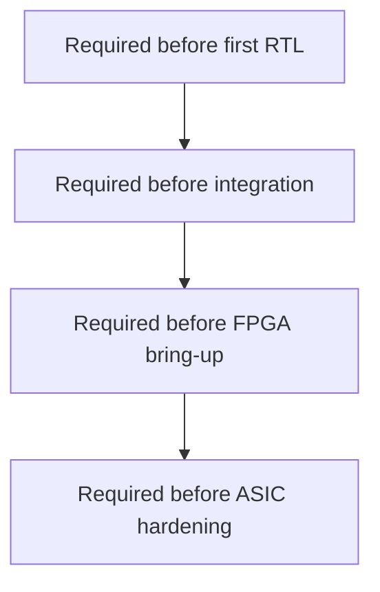

# Design Decisions

This document tracks decisions that need to be made before or during RTL
implementation. Decisions start as open questions, then move into accepted
architecture once the tradeoff is resolved.

## Decision Priority

The first implementation should decide only what blocks progress. Later design
choices should stay open until simulation or FPGA bring-up exposes real
constraints.



## Immediate Decisions

| Topic | Default Choice | Why It Matters |
| --- | --- | --- |
| Framebuffer format | RGB565 only | Simplifies write masks, scanout conversion, and golden frames. |
| Internal resolution | 160x120 | Fits in BRAM and keeps simulation fast. |
| Output mode | 640x480 with 4x scale | Easy integer scaling and common timing target. |
| Command word size | 32 bits | Keeps command parser simple and host-friendly. |
| Command packet style | header with opcode and word count | Allows malformed packet detection. |
| Coordinate type | unsigned integer for Version 1 | Keeps clear and rectangle engines simple. |
| Reset style | synchronous inside portable RTL | Easier formal and ASIC timing treatment. |
| Clocking | one `gpu_clk` domain for Version 1 | Avoids premature CDC complexity. |
| Memory target | simulation RAM and BRAM first | DDR3 should not block first visible pixels. |
| Memory interface | valid/ready request and response | Supports BRAM, DDR3, and SRAM wrappers. |
| Memory bus width | 32-bit initial target | Natural fit for RGB565 byte masking. |
| Arbitration | scanout priority over writes | Stable display is more important than fill rate at first. |
| Error handling | sticky status bits | Host can inspect failures without racing transient pulses. |
| Host path | built-in command stream first, UART later | Keeps FPGA bring-up staged. |

## Decisions to Revisit Later

| Topic | Revisit When | Likely Options |
| --- | --- | --- |
| Signed coordinates | line/triangle engines begin | signed fixed-point, signed integer, or unsigned plus clipping. |
| Clip rectangle location | multiple draw units exist | shared pixel pipeline vs per-unit clipping. |
| Memory bus width | DDR3 integration starts | 32, 64, or controller-native width. |
| Scanout buffering | DDR3 scanout starts | direct reads, FIFO, or line buffer. |
| Double buffering | demos need tear-free updates | register-selected buffer or command-controlled swap. |
| Interrupts | host software becomes nontrivial | frame done, command done, error, FIFO threshold. |
| Formal depth targets | first proofs exist | bounded proof only, induction, or compositional proof. |
| ASIC PDK target | hardening experiment begins | Sky130, IHP, or another available PDK. |

## Decision Records

Use this format when a decision becomes binding:

```text
### Decision: short title

Status: proposed | accepted | superseded
Date: YYYY-MM-DD

Context:
What problem is being solved.

Decision:
The selected approach.

Consequences:
What gets easier, what gets harder, and what must be updated.
```

## Accepted Decisions

### Decision: Start with BRAM or inferred framebuffer

Status: accepted
Date: 2026-04-29

Context: DDR3 integration adds controller, calibration, width-conversion, and
possibly clock-domain complexity.

Decision: Version 1 uses simulation RAM and BRAM or inferred memory before
DDR3.

Consequences: First pixels arrive sooner. The memory abstraction must still be
defined early so DDR3 can replace BRAM later without rewriting draw units.

### Decision: Keep the portable core vendor-neutral

Status: accepted
Date: 2026-04-29

Context: The same graphics core should be reusable in simulation, on the Urbana
board, on future boards, and in ASIC-oriented experiments.

Decision: No AMD/Xilinx, Vivado, Urbana, DDR3, or board-pin primitive
instantiations are allowed under `rtl/`.

Consequences: Platform wrappers carry more integration logic. The core remains
cleaner and easier to lint, formally verify, and synthesize outside Vivado.
