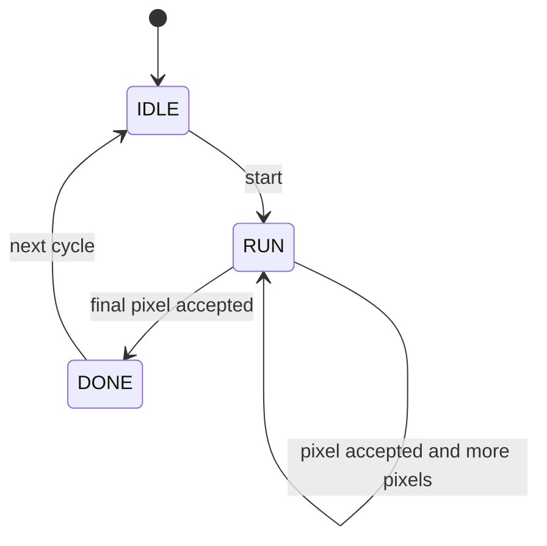

# Clear Engine

The clear engine fills the active framebuffer with a single RGB565 color.

## Purpose

Clear is the first draw unit because it exercises the full memory-write path
without shape clipping complexity.


## Inputs

```text
start
color
framebuffer_base
width
height
stride_bytes
```

## Outputs

```text
busy
done
error
pixel_valid
pixel_ready
pixel_x
pixel_y
pixel_color
```

## Behavior

- On `start`, latch configuration.
- Iterate from `(0, 0)` to `(width - 1, height - 1)`.
- Emit one pixel when `pixel_ready` is high.
- Hold current pixel stable while backpressured.
- Assert `done` after the final pixel is accepted.
- Treat zero width or zero height as an immediate no-op completion.

## State Machine



## Test Cases

| Test | Expected Result |
| --- | --- |
| 1x1 clear | One write at address base. |
| 4x3 clear | Twelve writes in row-major order. |
| Backpressure | Pixel coordinates and color remain stable while stalled. |
| Zero width | No pixel writes, `done` asserted. |
| Reset during run | Stops writes and returns idle. |

## Implementation Notes

The clear engine should not compute byte addresses. It emits coordinates and
color. Address calculation belongs in the framebuffer writer.
