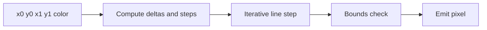

# Line Engine

The line engine is a Version 2 target. It should draw integer 2D lines using a
hardware-friendly algorithm such as Bresenham.

## Pipeline



## Initial Features

- horizontal lines
- vertical lines
- diagonal lines
- arbitrary octants
- safe bounds checking
- one pixel per accepted cycle

## Suggested Inputs

```text
start
x0
y0
x1
y1
color
framebuffer_width
framebuffer_height
```

## Key Design Choice

Start with per-pixel bounds checks instead of full geometric line clipping. It
is simpler and safer for the first hardware version. Full clipping can be added
later if performance requires it.

## Test Cases

| Test | Expected Result |
| --- | --- |
| Horizontal | Consecutive x coordinates at constant y. |
| Vertical | Consecutive y coordinates at constant x. |
| Diagonal positive slope | Balanced x/y stepping. |
| Diagonal negative slope | Correct y direction. |
| Off-screen endpoints | No out-of-bounds writes. |
| Single point | One pixel write. |

## Future Improvements

- Cohen-Sutherland clipping
- line width greater than one pixel
- stipple pattern
- anti-aliasing experiment
