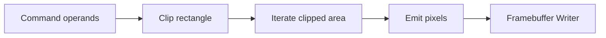
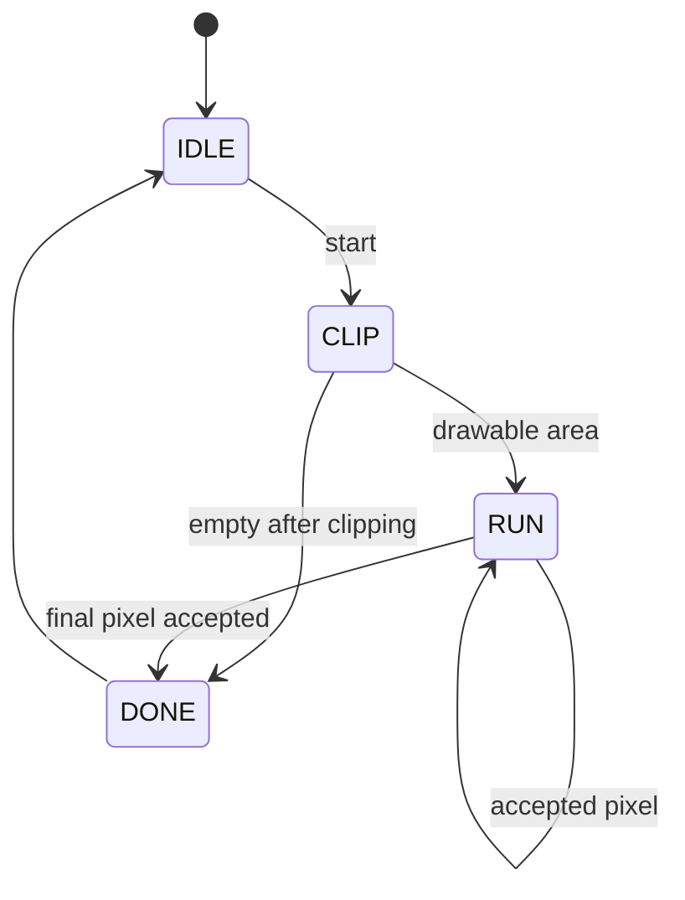

# Rectangle Fill Engine

The rectangle fill engine draws solid filled rectangles with framebuffer bounds
clipping.

## Purpose

Rectangle fill is the first shape engine. It verifies command operands,
clipping, nested iteration, and pixel write backpressure.



## Inputs

```text
start
x
y
rect_width
rect_height
color
framebuffer_width
framebuffer_height
```

## Outputs

```text
busy
done
error
pixel_valid
pixel_ready
pixel_x
pixel_y
pixel_color
```

## Clipping Rules

- Negative coordinates may be supported later. Version 1 can use unsigned
  coordinates and clip only upper bounds.
- If `x >= framebuffer_width`, the rectangle is outside and completes as no-op.
- If `y >= framebuffer_height`, the rectangle is outside and completes as no-op.
- If `x + width` exceeds framebuffer width, clamp the right edge.
- If `y + height` exceeds framebuffer height, clamp the bottom edge.
- Zero width or zero height completes as no-op.

## State Machine



## Test Cases

| Test | Expected Result |
| --- | --- |
| Fully inside | Writes exactly `width * height` pixels. |
| Right-edge clip | Writes only visible columns. |
| Bottom-edge clip | Writes only visible rows. |
| Corner clip | Clips both axes. |
| Fully outside | No writes, completes. |
| Backpressure | Holds current pixel stable. |

## Implementation Notes

Perform clipping once at command start. Store clipped min and max coordinates,
then iterate using simple counters.
