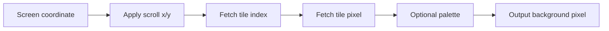

# Tile Engine

The tile engine provides a background layer using tile graphics and a tile index
map. It is a natural path toward a retro-console-style graphics system.

## Concept

## Initial Features

- tile index map
- tile graphics memory
- scroll X and Y registers
- one background layer
- optional palette support

## Suggested Parameters

| Parameter | Initial Value |
| --- | ---: |
| Tile size | 8x8 |
| Map size | 32x32 tiles |
| Pixel format | RGB565 or INDEX8 |
| Layers | 1 |

## Integration Options

The tile engine can be implemented as:

1. a draw unit that renders tilemap contents into the framebuffer
2. a scanout-time layer that fetches tile pixels while video is active

For this project, start with framebuffer rendering. Scanout-time layering is
more timing-sensitive and should wait until the memory system is stronger.

## Test Cases

| Test | Expected Result |
| --- | --- |
| Single tile | Correct 8x8 block appears. |
| Repeated tile | Map indexing is correct. |
| Scroll X | Horizontal scroll wraps or clamps as specified. |
| Scroll Y | Vertical scroll wraps or clamps as specified. |
| Palette mode | Index maps to expected RGB color. |

## Later Features

- multiple layers
- per-tile attributes
- priority
- flipping
- larger maps
- scanout-time composition
