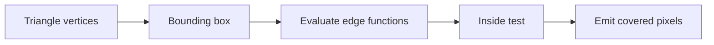

# Triangle Rasterizer

The triangle rasterizer is a long-term milestone for flat-shaded 2D triangles.

## Initial Goal

Draw solid-color screen-space triangles using integer or fixed-point edge
functions.



## Inputs

```text
x0, y0
x1, y1
x2, y2
color
```

## Edge Function

For an edge from `a` to `b` and point `p`:

```text
edge(a, b, p) = (p.x - a.x) * (b.y - a.y) - (p.y - a.y) * (b.x - a.x)
```

A point is inside the triangle when all edge functions have the expected sign,
after choosing a winding convention.

## Hardware Strategy

Start with:

- integer coordinates
- bounding-box iteration
- incremental edge function updates
- solid color
- framebuffer bounds clipping

Avoid texture coordinates, depth, and perspective correction until flat
triangles are correct.

## Test Cases

| Test | Expected Result |
| --- | --- |
| Small right triangle | Expected pixels covered. |
| Large triangle | No missing scanlines. |
| Degenerate triangle | No writes or defined line behavior. |
| Winding variants | Either accepted consistently or rejected consistently. |
| Clipped triangle | No out-of-bounds writes. |

## Later Features

- depth buffer
- barycentric interpolation
- texture coordinates
- perspective correction
- shader-like arithmetic stage
