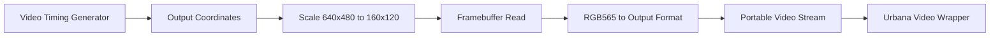

# Video Pipeline

The first video goal is a stable visible output. GPU integration comes after
basic timing and test patterns work.

## Pipeline Overview



## Initial Display Mode

```text
internal render resolution: 160x120
output resolution: 640x480
scale factor: 4x
internal color format: RGB565
```

Each framebuffer pixel maps to a 4x4 block on the output display.

## Bring-Up Pattern Sequence

Before framebuffer scanout, the video wrapper should display:

1. solid color
2. color bars
3. checkerboard
4. moving square
5. static framebuffer
6. GPU-updated framebuffer

This sequence narrows failures quickly:

- no output means clocking, reset, pins, or video timing issue
- wrong colors means color packing or output mapping issue
- distorted shapes means timing or coordinate issue
- static framebuffer works but GPU does not means command or memory path issue

## Portable Video Stream

The portable core should expose a stream similar to:

```text
video_valid
video_ready
video_hsync
video_vsync
video_de
video_x
video_y
video_rgb
```

The platform wrapper decides how this maps to the Urbana video pins.

## Scanout Behavior

The scanout module owns output coordinate sequencing. It should:

- generate stable coordinates
- compute framebuffer coordinates by integer scaling
- request framebuffer reads early enough to cover memory latency
- output a default border or blank color when inactive
- expose frame and line pulses for debug

## Memory Latency Plan

Version 1 should allow a small fixed read latency in simulation and BRAM.
If DDR3 is added later, add a line buffer or small FIFO between memory reads and
active video output.

## Debug Signals

Useful platform-visible debug signals:

- current frame counter
- active video flag
- scanout underflow flag
- framebuffer read request count
- last read address
- color test mode selector
