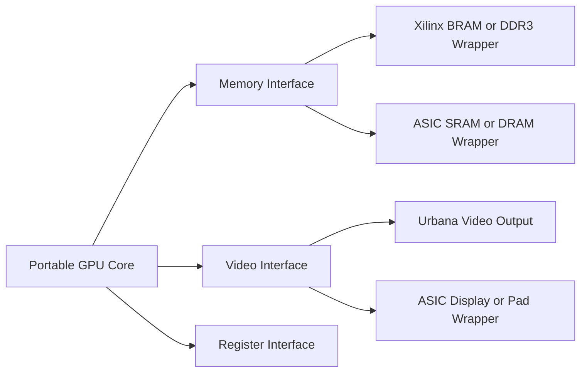

# ASIC Portability

The design does not need to be ASIC-ready on day one. It should avoid choices
that make an ASIC path unnecessarily expensive later.

## Replacement Boundary

## Rules

- Keep vendor primitives out of `rtl/`.
- Use wrappers for RAM, PLL, I/O, DDR3, and board features.
- Avoid inferred latches.
- Avoid gated clocks unless deliberately designed and reviewed.
- Avoid internal tri-state buses.
- Do not rely on FPGA register initialization.
- Keep memories behind abstract interfaces.
- Keep testbenches independent from FPGA tools.
- Prefer simple valid/ready handshakes.
- Keep timing-critical paths easy to inspect.

## FPGA to ASIC Replacement Table

| FPGA Component | ASIC Replacement |
| --- | --- |
| Xilinx PLL/MMCM | ASIC PLL or external clocking wrapper. |
| Xilinx BRAM | SRAM macro wrapper. |
| Xilinx DDR3 IP | ASIC memory controller or external memory interface. |
| Vivado constraints | ASIC SDC timing constraints. |
| FPGA I/O buffers | ASIC pad cells. |
| FPGA reset behavior | Explicit ASIC reset strategy. |
| FPGA-specific video output | Display controller or pad-level output wrapper. |

## ASIC Stub Directory

`platform/asic/` reserves space for:

- `asic_top_stub.sv`
- `sram_wrapper_stub.sv`
- `pll_wrapper_stub.sv`
- `pad_wrapper_stub.sv`

These stubs should compile only when an ASIC-oriented build target is selected.

## Lint Expectations

ASIC-aware lint should flag:

- latch inference
- combinational loops
- undriven signals
- multi-driven signals
- incomplete resets where reset is required
- unintended clock gating
- unsynchronized CDC paths

## Portability Exit Criteria

A module is considered portable when it:

- compiles without platform files
- simulates with platform simulation models
- uses no vendor primitive instances
- has deterministic reset behavior
- exposes external dependencies as ports or interfaces
