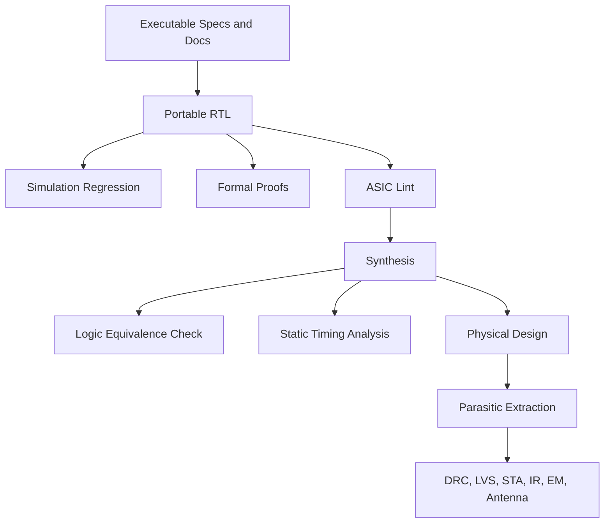

# ASIC Signoff Flow

This project can support an ASIC-style flow without letting physical design
block the FPGA learning path. The practical target is:

```text
FPGA-visible GPU first,
formally proven reusable blocks in parallel,
ASIC hardening experiment after architecture stabilizes.
```

## Flow Overview



## ASIC-Style Stages

| Stage | Purpose | Project Output |
| --- | --- | --- |
| Specification | Freeze behavior before implementation. | Command, register, memory, and video specs. |
| RTL | Implement portable synthesizable logic. | `rtl/` modules. |
| Simulation | Validate functional examples and golden frames. | Passing regressions and generated frames. |
| Formal | Prove protocol and bounded control properties. | `formal/` proofs and reports. |
| Lint | Catch structural RTL issues early. | Lint reports with waivers only when justified. |
| Synthesis | Map RTL to standard cells. | Gate netlist, area, timing, power estimates. |
| LEC | Prove gate netlist matches RTL. | Equivalence report. |
| DFT | Prepare scan and test hooks. | DFT plan, test mode interface, scan wrappers. |
| STA | Prove timing across corners. | SDC plus timing reports. |
| Physical design | Create layout. | Floorplan, placed/routed database, GDS. |
| Signoff | Check manufacturability and electrical safety. | DRC, LVS, antenna, IR, EM, final STA. |

## Open-Source Approximation

| Need | Candidate Tools |
| --- | --- |
| Lint | Verilator, Yosys `check`, Slang, svlint |
| Formal | Yosys, SymbiYosys, smtbmc, Boolector, Z3, Yices |
| Synthesis | Yosys, OpenLane, OpenROAD |
| PDK | Sky130 or IHP when available |
| STA | OpenSTA |
| Physical design | OpenROAD or OpenLane |
| DRC/LVS | Magic, KLayout, Netgen, PDK decks |
| LEC | Yosys equivalence flow |

Commercial signoff uses tools such as Design Compiler or Genus, Formality or
Conformal, PrimeTime or Tempus, Innovus or ICC2, and foundry-qualified signoff
decks.

## What Changes in the Plan

To support ASIC-style work, add these lanes:

1. stricter specification before RTL
2. formal property development from first reusable blocks
3. ASIC lint baseline before large integration
4. SRAM wrapper strategy before memory-heavy features
5. SDC timing constraints before synthesis experiments
6. DFT planning before top-level hardening
7. LEC after every synthesis milestone
8. OpenROAD/OpenLane hardening experiment after Version 1 core stabilizes

## What Does Not Change

The FPGA milestone remains the first visible goal. A working display catches
integration errors that pure ASIC flow will not expose.

Do not block Version 1 on:

- DDR3
- scan insertion
- physical layout
- multi-corner timing closure
- foundry-qualified signoff

## ASIC Hardening Candidate

The first ASIC experiment should not include the entire Urbana platform. A
reasonable hardening target is:

```text
gpu_core
command_processor
register_file
clear_engine
rect_fill_engine
framebuffer_writer
memory_arbiter
small SRAM wrapper model
```

Video output and host I/O can be modeled as abstract interfaces.
