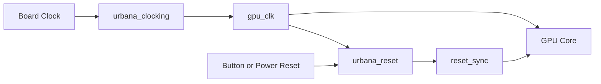

# Clocking and Reset

Version 1 starts with one primary clock domain. This keeps early simulation,
debug, and hardware bring-up focused on graphics behavior.

## Version 1 Clock Plan

```text
gpu_clk
reset_sync
```

All portable core modules are synchronous to `gpu_clk`.



## Reset Requirements

Reset must be asserted long enough for platform clocking to become stable.
After reset deassertion:

- command FIFO is empty
- command processor is idle
- draw units are idle
- memory requests are inactive
- video scanout starts at a deterministic coordinate
- status registers report idle unless a platform fault exists

## Later Clock Domains

Later versions may split clocks:

| Clock | Purpose |
| --- | --- |
| `gpu_clk` | Command processing and draw units. |
| `video_clk` | Pixel timing and output serialization. |
| `memory_clk` | DDR3 or external memory controller. |
| `host_clk` | UART, USB bridge, or host bus interface. |

## CDC Rules

When multiple domains are introduced:

- single-bit controls use two-flop synchronizers
- pulses crossing domains use toggle or handshake synchronizers
- multi-bit data uses asynchronous FIFOs or stable handshake protocols
- resets are synchronized per destination clock domain
- CDC paths are documented in the module header and verification plan

## Deferred Complexity

The first working framebuffer should not depend on DDR3 timing, asynchronous
FIFOs, or independent video clocks. Those are important, but they should be
added after the basic render and scanout path is proven.
