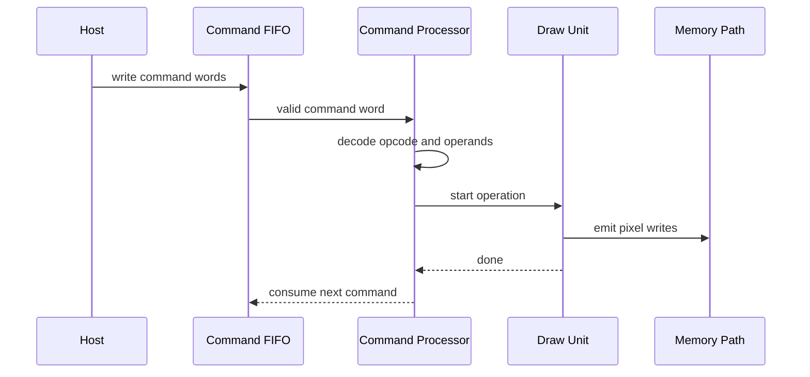

# Command Format

The command stream is a simple sequence of 32-bit words. Version 1 supports
only the commands needed to clear and draw filled rectangles.

## Command Flow



## Word Layout

Every command starts with a header word:

```text
31        24 23        16 15                         0
+------------+------------+---------------------------+
| opcode     | word_count | flags                     |
+------------+------------+---------------------------+
```

`word_count` includes the header word. This lets the command processor skip or
flag malformed packets deterministically.

## Version 1 Opcodes

| Opcode | Name | Words | Description |
| --- | --- | ---: | --- |
| `0x00` | `NOP` | 1 | No operation. |
| `0x01` | `CLEAR` | 2 | Fill the framebuffer with one RGB565 color. |
| `0x02` | `FILL_RECT` | 5 | Fill a clipped rectangle. |
| `0x03` | `WAIT_IDLE` | 1 | Stall command execution until all draw units are idle. |
| `0x10` | `SET_REGISTER` | 3 | Write one register by byte address. |

## CLEAR Packet

```text
word 0: header opcode=CLEAR, word_count=2
word 1: color[15:0]
```

The clear engine uses current framebuffer registers:

- base
- width
- height
- stride
- format

## FILL_RECT Packet

```text
word 0: header opcode=FILL_RECT, word_count=5
word 1: x[15:0], y[15:0]
word 2: width[15:0], height[15:0]
word 3: color[15:0]
word 4: reserved
```

`reserved` must be written as zero in Version 1. The command processor may
ignore it now and validate it later.

## SET_REGISTER Packet

```text
word 0: header opcode=SET_REGISTER, word_count=3
word 1: register byte address
word 2: register write data
```

This gives simple command-stream control without requiring a separate bus in
early simulation.

## WAIT_IDLE Semantics

`WAIT_IDLE` completes when:

- command processor has no active dispatch
- all draw units are idle
- framebuffer writer has accepted all pending writes
- memory arbiter has no outstanding writes from the command

## Error Handling

The command processor sets sticky error bits for:

- unknown opcode
- incorrect `word_count`
- FIFO underflow while reading a packet
- unsupported framebuffer format
- invalid reserved bits when strict validation is enabled

Errors do not require the hardware to hang. The processor should enter a safe
idle state and wait for software to clear or reset the error.
