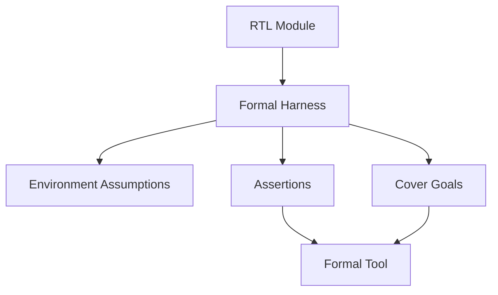

# Formal Verification Plan

Formal verification is a parallel lane for proving control, protocol, and
addressing properties. It should start with small reusable blocks and expand
only after the RTL interfaces are stable.

## Scope

Formal is best suited for:

- FIFOs
- skid buffers
- valid/ready protocol blocks
- command packet parsing
- framebuffer address generation
- memory arbitration
- draw-unit termination and bounds safety

Formal is not the only verification method. Image correctness, video output,
and command-stream behavior still need simulation and hardware tests.

## Property Categories

| Category | Meaning | Example |
| --- | --- | --- |
| Safety | Bad states never happen. | FIFO never pops when empty. |
| Liveness | Progress eventually happens under assumptions. | A started clear eventually completes if memory is ready often enough. |
| Protocol | Interfaces obey handshake rules. | Payload is stable while `valid && !ready`. |
| Reset | Reset reaches known safe state. | No memory write is active after reset. |
| Bounds | Addresses and coordinates stay legal. | Rectangle fill never writes outside framebuffer bounds. |
| Ordering | Sequence is preserved. | FIFO outputs data in push order. |

## Formal Architecture



## Initial Proof Targets

| Block | Proof Goals |
| --- | --- |
| `fifo.sv` | no overflow, no underflow, order preservation, reset state. |
| `skid_buffer.sv` | no data loss, no duplication, valid/ready stability. |
| `clear_engine.sv` | exactly bounded pixel count, termination, backpressure safety. |
| `rect_fill_engine.sv` | clipped bounds, no out-of-range pixels, termination. |
| `framebuffer_writer.sv` | correct address math and byte masks. |
| `memory_arbiter.sv` | one grant at a time, no dropped accepted request, eventual service under fairness assumptions. |
| `command_processor.sv` | legal packet decode, malformed packet error, no draw start with incomplete operands. |

## Directory Plan

```text
formal/
  properties/
    valid_ready_properties.sv
    fifo_properties.sv
    command_processor_properties.sv
    clear_engine_properties.sv
    rect_fill_engine_properties.sv
    framebuffer_writer_properties.sv
    memory_arbiter_properties.sv
  harnesses/
    fifo_formal.sv
    clear_engine_formal.sv
    rect_fill_engine_formal.sv
  scripts/
    run_sby.sh
    fifo.sby
    clear_engine.sby
    rect_fill_engine.sby
```

## Open-Source Tool Path

Recommended starting stack:

```text
Yosys
SymbiYosys
smtbmc
Boolector, Z3, or Yices
```

This is sufficient for serious block-level proofs. Commercial formal tools can
be introduced later if available.

## Assumption Discipline

Every assumption must represent the environment, not hide a design bug.

Examples of acceptable assumptions:

- reset is asserted at the beginning of a proof
- framebuffer width and height are nonzero and within parameter bounds
- downstream `ready` is asserted infinitely often for liveness proofs
- command FIFO delivers stable data while valid and not ready

Examples of risky assumptions:

- memory is always ready
- no malformed commands arrive
- coordinates are always in range
- start never occurs while busy unless the RTL enforces that externally

## Coverage Goals

Formal cover statements should show that important states are reachable:

- FIFO fills and drains
- clear engine completes a multi-row frame
- rectangle engine clips on right and bottom edges
- command processor detects an illegal opcode
- arbiter grants each client

## Exit Criteria

Initial formal adoption is successful when:

- reusable valid/ready properties exist
- FIFO proof passes
- clear and rectangle engines have safety proofs
- framebuffer writer address and mask proofs pass
- formal commands are documented and runnable from `formal/scripts/`
