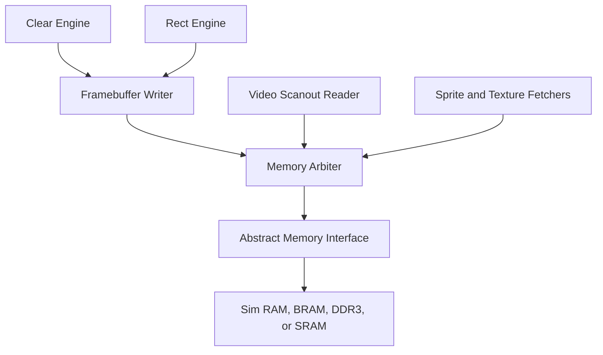

# Memory System

The memory system starts with a small framebuffer and grows into an abstract
interface that can target simulation RAM, FPGA BRAM, DDR3, or ASIC SRAM.

## Phase 1: Internal Framebuffer

Initial render target:

```text
width: 160
height: 120
format: RGB565
bytes per pixel: 2
framebuffer size: 38,400 bytes
```

This fits comfortably in FPGA block RAM and is small enough for fast simulation.

## Address Calculation

For RGB565:

```text
byte_addr = framebuffer_base + y * stride_bytes + x * 2
```

For Version 1:

```text
stride_bytes = framebuffer_width * 2
```

Future versions may allow a larger stride for alignment and double buffering.

## Abstract Request Interface

```text
mem_req_valid
mem_req_ready
mem_req_write
mem_req_addr
mem_req_wdata
mem_req_wmask
```

## Abstract Response Interface

```text
mem_rsp_valid
mem_rsp_ready
mem_rsp_rdata
```

## Memory Client Diagram



## Arbitration Policy

Version 1 can use a simple fixed-priority or round-robin arbiter. The main
functional requirement is that scanout and writes do not corrupt each other.

Initial priority recommendation:

1. video scanout read
2. framebuffer writer
3. command or future fetch clients

This favors stable display. Later versions can add buffering to relax scanout
priority.

## Write Masking

RGB565 pixels are 16-bit values. The abstract memory bus may be wider than one
pixel, so writes include byte masks.

For a 32-bit bus:

| Pixel Address Bit 1 | Write Data Placement | Write Mask |
| --- | --- | --- |
| 0 | `wdata[15:0]` | `4'b0011` |
| 1 | `wdata[31:16]` | `4'b1100` |

## Phase 2: DDR3 Wrapper

The DDR3 controller is platform-specific and belongs under `platform/urbana/`.
The core sees the same abstract memory interface.

The wrapper is responsible for:

- controller initialization
- burst formation
- clock-domain crossing if needed
- width conversion
- response ordering
- backpressure

## Verification Targets

- address calculation for first, last, and clipped pixels
- byte lane selection
- no writes outside framebuffer bounds
- read-after-write behavior in simulation memory
- arbitration under simultaneous scanout and drawing
