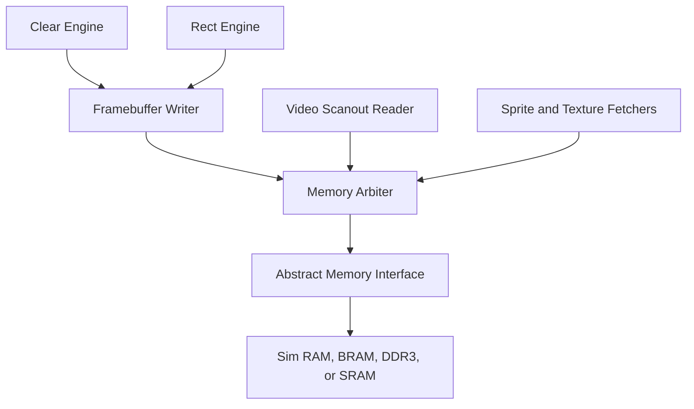

# Memory System

The memory system starts with a small framebuffer and grows into an abstract
interface that can target simulation RAM, FPGA BRAM, DDR3, or ASIC SRAM.

## Phase 1: Internal Framebuffer

Initial render target:

```text
width: 160
height: 120
format: RGB565
bytes per pixel: 2
framebuffer size: 38,400 bytes
```

This fits comfortably in FPGA block RAM and is small enough for fast simulation.

## Address Calculation

For RGB565:

```text
byte_addr = framebuffer_base + y * stride_bytes + x * 2
```

For Version 1:

```text
stride_bytes = framebuffer_width * 2
```

Future versions may allow a larger stride for alignment and double buffering.

## Abstract Request Interface

```text
mem_req_valid
mem_req_ready
mem_req_write
mem_req_addr
mem_req_wdata
mem_req_wmask
mem_req_id
```

## Abstract Response Interface

```text
mem_rsp_valid
mem_rsp_ready
mem_rsp_rdata
mem_rsp_id
mem_rsp_error
```

The request ID is split into arbiter source bits plus a source-local opaque ID:

```text
mem_req_id = source_id || local_request_id
```

The response path routes by `source_id` and returns `local_request_id` unchanged
to the selected client. The first integrated RTL arbiter is a fixed-priority mux
with this identity contract. A separate round-robin arbiter leaf now exists for
future high-rate clients. It preserves the same request-ID and response-routing
contract while rotating priority only after an accepted request.

The current `gpu_core` top-level memory port exposes `mem_req_id` and
`mem_rsp_id`. Simple in-order memories should return the accepted `mem_req_id`
with each response. `gpu_core` still uses an in-order response tracker for
outstanding-capacity accounting:

```text
accepted requests and responses are in-order
one accepted request produces one accepted response
```

A future pipelined or out-of-order memory wrapper can return a real response ID
without changing the core-side response routing.

## Memory Client Diagram



## Arbitration Policy

Version 1 can use fixed-priority arbitration while requesters are blocking or
low-throughput. The integrated arbiter grants the lowest-index valid client.
The `memory_arbiter_rr` leaf is the scale-prep option for more symmetric
clients: it starts at client 0 after reset, skips inactive clients, holds its
grant under backpressure, and advances the starting point only when the memory
accepts a request. The functional requirement for either policy is that accepted
requests preserve payload and responses route to exactly one client by ID.

Initial priority recommendation:

1. video scanout read once display output matters
2. framebuffer writer or programmable LSU, depending on active demo
3. command or future fetch clients

Later versions can add buffering or weighted arbitration to relax scanout
priority. Switch to round-robin before high-rate DMA, multiple peer cores, or
cache refills unless a written priority rule says otherwise.

## Framebuffer Scanout Leaf

`framebuffer_scanout` is the first portable read client for video bring-up. It
is not a timing generator and does not own VGA/HDMI sync. It walks a framebuffer
allocation in row-major order, issues one 32-bit read for two RGB565 pixels, and
emits a valid/ready pixel stream with `x`, `y`, and 16-bit color. Odd frame
widths drop the unused high halfword at end of row.

Unit coverage includes odd-width, even-width, width-1, request backpressure,
pixel backpressure, response error, and widened local response-ID mismatch
cases.

Integration coverage connects the scanout read client and framebuffer writer to
the round-robin arbiter, forces request contention, verifies writer-first then
scanout grant order, and returns the scanout response by source ID.

Current limits:

- one outstanding memory read
- 32-bit memory data path
- RGB565 pixels only
- no line buffer
- no double buffering
- no integration into `gpu_core` yet

This makes scanout a memory client that can be arbitrated and tested before the
platform video timing layer exists.

## Write Masking

RGB565 pixels are 16-bit values. The abstract memory bus may be wider than one
pixel, so writes include byte masks.

For a 32-bit bus:

| Pixel Address Bit 1 | Write Data Placement | Write Mask |
| --- | --- | --- |
| 0 | `wdata[15:0]` | `4'b0011` |
| 1 | `wdata[31:16]` | `4'b1100` |

## Phase 2: DDR3 Wrapper

The DDR3 controller is platform-specific and belongs under `platform/urbana/`.
The core sees the same abstract memory interface.

The wrapper is responsible for:

- controller initialization
- burst formation
- clock-domain crossing if needed
- width conversion
- response ordering
- backpressure

## Verification Targets

- address calculation for first, last, and clipped pixels
- byte lane selection
- no writes outside framebuffer bounds
- read-after-write behavior in simulation memory
- arbitration under simultaneous scanout and drawing
- framebuffer scanout address walk, odd-width high-half suppression, request
  backpressure, pixel backpressure, and response error reporting
- response-ID routing when responses return in a different order than requests
  were accepted
