# Roadmap

The roadmap now follows one architecture: a unified programmable tiny GPU.
Intermediate milestones are implementation steps, not separate product
versions. Avoid building a fixed-function graphics accelerator and later
rewriting it into a programmable GPU.

## Phase Diagram

```mermaid
gantt
  title UrbanaGPU Programmable Architecture Roadmap
  dateFormat X
  axisFormat %s
  section Foundation
  Project scaffold and toolchain      :0, 1
  Command FIFO and register file      :1, 1
  Fixed-function smoke path           :2, 1
  Architecture specification          :3, 1
  section Programmable Core
  ISA encoding                        :4, 1
  Lane register file                  :5, 1
  SIMD ALU                            :6, 1
  Instruction fetch and decode        :7, 2
  Scheduler 1 core x 4 lanes          :9, 2
  Blocking load-store unit            :11, 2
  section Kernel Tests
  vector_add                          :13, 2
  STORE16 and framebuffer writes      :15, 1
  framebuffer_gradient                :16, 2
  bounded fill kernel                 :18, 2
  section Platform
  Simulation RAM                      :10, 2
  Video scanout from global memory    :16, 2
  Urbana framebuffer display          :18, 3
  section Signoff Discipline
  Block formal proofs                 :7, 8
  Open-source synthesis smoke         :10, 6
  Vivado synthesis smoke              :14, 6
  Timing and constraints              :16, 8
  section Scaling
  Scratchpad experiment               :21, 3
  Multi-core memory IDs               :24, 2
  More lanes per core                 :26, 2
  Cache experiment                    :28, 4
```



## Completed Foundation

- repository scaffold
- documentation scaffold
- native RTL toolchain checks
- command FIFO
- command processor
- command-processor WAIT_IDLE, RECT reserved-field, and CLEAR/RECT dispatch-busy unit coverage
- register file
- clear and rectangle fixed-function smoke engines
- clear-engine pixel backpressure unit coverage
- clear-engine bounded formal smoke
- rect-fill clipping, no-op, busy-start, and pixel backpressure unit coverage
- framebuffer writer
- framebuffer-writer base/stride, clipping, and memory backpressure unit coverage
- RTL simulation runner
- lint configuration
- open-source synthesis smoke target

These blocks are now infrastructure for the programmable GPU, not the whole
architecture.

## Completed Programmable Core Bring-Up

- programmable architecture documents
- initial ISA envelope and helpers
- instruction memory model
- instruction decoder
- special register mux
- lane register file
- SIMD ALU
- basic SIMD core
- 1 core x 4 lane scheduler
- blocking LSU
- simulation data memory with byte masks
- convergent branch support
- compare instruction
- predicated 32-bit and 16-bit stores
- instruction memory bounded formal smoke
- register file bounded formal smoke
- lane register file bounded formal smoke
- LSU prep bounded formal smoke
- LSU request/response transition bounded formal smoke
- LSU multi-lane response routing bounded formal smoke
- special register mux bounded formal smoke
- simulation data memory bounded formal smoke
- integrated programmable core Yosys synthesis smoke
- programmable-core illegal-instruction integration coverage
- programmable-core zero-sized launch integration coverage
- programmable-core convergent branch integration coverage
- programmable-core divergent branch fault integration coverage
- programmable-core unaligned memory fault integration coverage
- programmable-core memory backpressure integration coverage
- programmable-core predicated 32-bit store integration coverage

The first programmable GPU path now executes encoded kernels through scheduler,
core, LSU, and simulation memory.

Implemented instruction subset:

```text
NOP
END
MOVI
MOVSR
ADD
SUB
AND
OR
XOR
SHL
SHR
MUL
CMP
BRA
LOAD
STORE
STORE16
PSTORE
PSTORE16
```

## Current Milestone: Verification and Platform Readiness

Near-term work should harden the existing programmable path rather than adding
speculative GPU features:

- add block-level formal proofs for decoder, register file, scheduler, LSU, and
  memory-facing protocol behavior
- add coverage-oriented integration tests for corner kernels
- run the optional Vivado synthesis smoke before FPGA platform claims
- keep docs aligned with implemented ISA and kernel behavior

## First Kernel Milestone: `vector_add`

Goal:

```text
C[i] = A[i] + B[i]
```

Proves:

- kernel launch
- global ID generation
- special register reads
- address arithmetic
- global loads
- ALU add
- global stores
- tail-lane handling

Exit criteria:

- deterministic RTL simulation: done
- initialized memory fixture: done
- expected output comparison: done
- timeout on hang: done
- zero sticky errors: done

## Second Kernel Milestone: `framebuffer_gradient`

Goal:

```text
framebuffer[y][x] = rgb565(x, y, constant)
```

Proves:

- 2D IDs
- RGB565 packing
- `STORE16`
- framebuffer memory convention
- golden framebuffer comparison

Exit criteria:

- memory comparison passes: done
- optional generated image artifact
- no fixed-function pixel writer required: done

## Third Kernel Milestone: Bounded Fill

Goal:

```text
if pixel inside rectangle:
  store color
```

Decision: use no-branch predicated stores before adding divergent branch masks.
This keeps the shared-PC SIMD core simple while enabling bounded graphics
kernels.

Implemented coverage:

- top-left bounded fill using `CMP` + `AND` + `PSTORE16`
- offset 1x1 fill using lower and upper bounds
- low-half and high-half RGB565 preservation checks

## Scaling Lane

Scaling is deliberately staged:

1. single core, four lanes
2. harden block formal and protocol coverage
3. Vivado synthesis and FPGA smoke path
4. more lanes per core
5. per-core scratchpad
6. memory request IDs
7. multiple cores
8. read-only or instruction cache
9. data cache
10. divergence masks and reconvergence

Do not add caches before the blocking memory model is correct. Do not add
multiple cores before memory responses have routing identity.

## ASIC and FPGA Lane

The programmable architecture must remain portable:

- no vendor primitives inside core RTL
- inferred or wrapped memories only
- synchronous reset policy remains explicit
- one clock domain until simulation and FPGA bring-up justify more
- ASIC SRAM wrappers kept separate from FPGA BRAM wrappers

Platform work should not define the core programming model.

## Stretch Goals

Stretch goals are valid only after the first programmable kernels pass:

- assembler
- waveform/debug trace tooling
- scratchpad memory
- predicated execution
- divergent branch masks
- UART command input
- video scanout with double buffering
- DDR3 global memory wrapper
- simple instruction cache
- simple data cache
- multi-core dispatch
