# Roadmap

The roadmap now follows one architecture: a unified programmable tiny GPU.
Intermediate milestones are implementation steps, not separate product
versions. Avoid building a fixed-function graphics accelerator and later
rewriting it into a programmable GPU.

## Phase Diagram

```mermaid
gantt
  title UrbanaGPU Programmable Architecture Roadmap
  dateFormat X
  axisFormat %s
  section Foundation
  Project scaffold and toolchain      :0, 1
  Command FIFO and register file      :1, 1
  Fixed-function smoke path           :2, 1
  Architecture specification          :3, 1
  section Programmable Core
  ISA encoding                        :4, 1
  Lane register file                  :5, 1
  SIMD ALU                            :6, 1
  Instruction fetch and decode        :7, 2
  Scheduler 1 core x 4 lanes          :9, 2
  Blocking load-store unit            :11, 2
  section Kernel Tests
  vector_add                          :13, 2
  STORE16 and framebuffer writes      :15, 1
  framebuffer_gradient                :16, 2
  bounded fill kernel                 :18, 2
  section Platform
  Simulation RAM                      :10, 2
  Video scanout from global memory    :16, 2
  Urbana framebuffer display          :18, 3
  section Signoff Discipline
  Block formal proofs                 :7, 8
  Open-source synthesis smoke         :10, 6
  Vivado synthesis smoke              :14, 6
  Timing and constraints              :16, 8
  section Scaling
  Scratchpad experiment               :21, 3
  Multi-core memory IDs               :24, 2
  More lanes per core                 :26, 2
  Cache experiment                    :28, 4
```



## Completed Foundation

- repository scaffold
- documentation scaffold
- native RTL toolchain checks
- command FIFO
- command processor
- command-processor WAIT_IDLE, RECT reserved-field, CLEAR/RECT dispatch-busy,
  LAUNCH_KERNEL validation/latch, and launch-config invalid unit coverage
- register file
- clear and rectangle fixed-function smoke engines
- clear-engine pixel backpressure unit coverage
- clear-engine bounded formal smoke
- rect-fill clipping, no-op, busy-start, and pixel backpressure unit coverage
- framebuffer writer
- framebuffer-writer base/stride, clipping, and memory backpressure unit coverage
- RTL simulation runner
- lint configuration
- open-source synthesis smoke target

These blocks are now infrastructure for the programmable GPU, not the whole
architecture.

## Completed Programmable Core Bring-Up

- programmable architecture documents
- initial ISA envelope and helpers
- instruction memory model
- instruction decoder
- special register mux
- lane register file
- SIMD ALU
- basic SIMD core
- 1 core x 4 lane scheduler
- work-scheduler core-error propagation unit coverage
- blocking LSU
- simulation data memory with byte and zero masks
- convergent branch support
- compare instruction
- predicated 32-bit and 16-bit stores
- instruction memory bounded formal smoke including high out-of-range fetch fault
- register file bounded formal smoke
- lane register file bounded formal smoke with R0 suppression and nonzero read covers
- work-scheduler sticky-error, public status, stalled launch, and tail-mask bounded formal smoke
- LSU prep bounded formal smoke
- LSU invalid-op containment unit coverage and bounded prep formal scenario
- LSU request/response transition bounded formal smoke
- LSU multi-lane response routing bounded formal smoke
- LSU public status and response-ready formal contracts
- LSU empty active-mask unit coverage
- LSU masked-lane fault suppression unit coverage
- special register mux bounded formal smoke
- special register mux illegal-ID, argument-base, and framebuffer-parameter bounded formal covers
- instruction decoder CMP reserved-field and highest-valid-CMP bounded formal
  cover
- instruction decoder unassigned-opcode side-effect suppression formal coverage
- instruction decoder memory-op side-effect formal contracts
- simulation data memory bounded formal smoke, out-of-range sticky-error response, and scenario reachability covers
- integrated programmable core Yosys synthesis smoke
- programmable-core illegal-instruction integration coverage
- programmable-core illegal special-register integration coverage
- programmable-core CMP reserved-bit illegal integration coverage
- programmable-core zero-sized launch integration coverage
- host-side assembler plus checked `.kgpu`/`.memh` fixtures used by
  command-level `gpu_core` and lower-level programmable-core integration tests
- checked scenario coverage manifest tying regression intent to simulation,
  kernel, and formal artifacts
- regression-observability tooling for simulation listing, exact-test
  selection, glob selection, custom output directories, opt-in VCD traces, full
  local `make regress`, and enforced simulation-test scenario accounting
- memory arbiter scale-prep leaves with fixed-priority and round-robin request
  selection, source-local request IDs, response-ID routing, unit simulation,
  bounded formal smoke, and Yosys synthesis coverage
- portable framebuffer scanout leaf reads 32-bit memory words into RGB565 pixel
  output, handles odd frame widths, request and pixel backpressure, and response
  errors in unit simulation, with additional even-width, width-1, and widened
  local-response-ID coverage; scanout-to-arbiter integration coverage verifies
  round-robin contention with framebuffer-writer traffic and routed scanout
  responses
- portable video timing leaf generates active-area pixel-valid, x/y coordinate,
  line-start, frame-start, hsync, and vsync timing from parameterized active,
  porch, and sync widths with tick-enable and sync-polarity unit coverage
- portable video test-pattern leaf emits RGB565 solid, bar, checker, and
  coordinate-gradient patterns from timing coordinates, with direct unit
  coverage and timing-to-pattern integration coverage
- portable video stream mux selects pattern or framebuffer RGB565 pixels under
  the same timing contract, preserves timing metadata, emits black on missing
  active-pixel sources, and flags source starvation in unit and integration
  coverage
- portable framebuffer-source adapter accepts scanout pixels only on active
  timing pixels, validates scanout coordinates against timing coordinates, and
  flags underrun or coordinate mismatch before framebuffer pixels reach the mux
- portable video pixel FIFO provides scanout-to-timing elasticity, preserves
  pixel coordinates and RGB565 color, supports full-cycle push/pop, exposes
  count/full/empty state, and flags overflow or underflow in unit and
  source/mux integration coverage
- full portable framebuffer video path integration coverage primes
  `framebuffer_scanout`, verifies a full-FIFO stall into `video_pixel_fifo`,
  drives `video_timing`, checks RGB565 output through
  `video_framebuffer_source` and `video_stream_mux`, and verifies blanking
  behavior without board-specific video logic
- portable `video_controller` wrapper composes timing, test-pattern,
  framebuffer scanout, pixel FIFO, framebuffer-source, and stream-mux leaves
  behind one video stream and memory-request interface, with pattern-mode and
  framebuffer-mode integration coverage; source-switch coverage documents that
  mode selection does not cancel scanout and that platform control must flush
  stale FIFO pixels during mode changes
- video timing and pixel FIFO leaves have bounded formal smoke coverage for
  timing output equations, sync regions, FIFO count/flag consistency, flush
  behavior, overflow/underflow reporting, and stalled-output payload stability
- framebuffer-source and stream-mux leaves have combinational formal smoke
  coverage for ready/valid, underrun, coordinate mismatch, source selection,
  missing-source blanking, and timing/control pass-through behavior
- video test-pattern leaf has combinational formal smoke coverage for
  timing-valid pass-through, inactive black output, solid color, color bars,
  checker, and RGB565 gradient packing
- simulation `video_controller_system` wrapper connects `video_controller` to
  round-robin arbitration, host framebuffer preload requests, and simulation
  data memory, with coverage for solid-pattern output, host-preloaded
  framebuffer scanout, host readback held under response backpressure, and
  host/video request contention through the round-robin memory path
- command-driven framebuffer-gradient scanout integration writes RGB565 pixels
  through `gpu_core` `STORE16` into simulation `data_memory`, then reads the
  same framebuffer convention through `framebuffer_scanout`
- simulation `gpu_video_controller_system` wrapper connects `gpu_core`,
  `video_controller`, round-robin arbitration, and shared `data_memory` so a
  command-driven framebuffer-gradient kernel can be displayed by the video
  controller path, including a concurrent GPU/video memory arbitration smoke
- `gpu_core` memory path uses the memory arbiter for framebuffer-writer and
  programmable LSU request selection while preserving stale-response drain
  behavior across active soft reset
- `gpu_core` top-level memory interface exposes request and response IDs for
  external memory wrappers
- command-level response-ID reorder regression returns a programmable LSU
  response before older fixed-function writer responses and verifies routing by
  external `mem_rsp_id`
- memory response tracker records accepted request IDs, returns oldest
  outstanding ID for in-order external responses, flags overflow/underflow, and
  has unit simulation, bounded formal coverage, and synthesis smoke
- directed malformed illegal-instruction fixtures use checked `.word` raw
  encodings
- programmable-core convergent, signed backward, and R0 predicate branch
  integration coverage
- programmable-core divergent branch fault integration coverage
- programmable-core unaligned memory fault integration coverage
- programmable-core memory backpressure integration coverage
- programmable-core STORE16 memory backpressure integration coverage
- programmable-core predicated 32-bit store integration coverage
- programmable-core R0-predicated 32-bit store no-op integration coverage
- programmable-core predicated STORE16 masked-fault integration coverage
- programmable-core all-false predicated STORE16 skip integration coverage
- command-driven launch register plumbing through `gpu_core` with
  LAUNCH_KERNEL latch smoke coverage
- command-driven `gpu_core` STORE16 kernel smoke through instruction memory,
  programmable core, LSU, and top-level memory response path
- command-driven `gpu_core` vector_add smoke through launch registers,
  argument-block loads, global input loads, and global output stores
- command-driven `gpu_core` nonzero `PROGRAM_BASE` launch smoke
- command-driven `gpu_core` 2D framebuffer-gradient smoke through `GRID_X`,
  `GRID_Y`, `GLOBAL_ID_X`, `GLOBAL_ID_Y`, framebuffer base, and `STORE16`
- command-driven `gpu_core` memory request backpressure and delayed response
  smoke in the vector_add path
- command-driven `gpu_core` launch-while-busy dispatch rejection and WAIT_IDLE
  barrier smoke while a kernel is stalled on memory
- command-driven `gpu_core` command-structure error smoke for unknown opcode,
  malformed word counts, and nonzero reserved header bits on every current
  command opcode
- command-driven `gpu_core` invalid-launch rejection through real launch
  registers for zero grid dimensions, unsupported group dimensions, and nonzero
  flags
- command-driven `gpu_core` soft reset while a kernel is stalled on memory,
  followed by successful relaunch
- command-driven `gpu_core` command FIFO flush while a blocked `WAIT_IDLE` has a
  queued `SET_REGISTER` behind it
- command-driven `gpu_core` odd-address STORE16 fault smoke through
  host-visible programmable error status
- command-driven `gpu_core` soft-reset recovery after programmable STORE16
  fault

The first programmable GPU path now executes encoded kernels through scheduler,
core, LSU, and simulation memory.

Implemented instruction subset:

```text
NOP
END
MOVI
MOVSR
ADD
SUB
AND
OR
XOR
SHL
SHR
MUL
CMP
BRA
LOAD
STORE
STORE16
PSTORE
PSTORE16
```

## Current Milestone: Verification and Platform Readiness

Near-term work should harden the existing programmable path rather than adding
speculative GPU features:

- add block-level formal proofs for decoder, register file, scheduler, LSU, and
  memory-facing protocol behavior
- add coverage-oriented integration tests for corner kernels
- run the optional Vivado synthesis smoke before FPGA platform claims
- keep docs aligned with implemented ISA and kernel behavior

Lifecycle and ABI specs:

- [Command and kernel lifecycle](../architecture/command_kernel_lifecycle.md)
- [Kernel ABI](../architecture/kernel_abi.md)

Current lifecycle/ABI coverage:

- command-driven `vector_add`
- command-driven nonzero `PROGRAM_BASE`
- command-driven 2D framebuffer-gradient kernel
- stalled request and delayed response memory smoke in command-driven
  `vector_add`
- launch-while-busy dispatch rejection and WAIT_IDLE barrier smoke
- queued `SET_REGISTER` behind blocked `WAIT_IDLE` does not retire while a
  command-driven kernel is stalled, then retires after `WAIT_IDLE` clears
- command FIFO flush while blocked `WAIT_IDLE` has a queued `SET_REGISTER`
  behind it
- command-structure error reporting through real `gpu_core` command path for
  unknown opcode, malformed word counts, and nonzero reserved header bits on
  every current command opcode
- `PROGRAM_BASE` launch snapshot behavior while a command-driven kernel is
  stalled
- `ARG_BASE` launch snapshot behavior while a command-driven kernel is stalled
- `GRID_X`/`GRID_Y` launch snapshot behavior while a command-driven kernel is
  stalled
- invalid-launch rejection through real `gpu_core` launch registers for zero
  grid dimensions, unsupported group dimensions, and nonzero flags
- active-kernel soft reset and relaunch while memory response is held
- host-visible odd-address `STORE16` fault
- soft-reset recovery after the `STORE16` fault

These are simulation coverage points. They do not imply compiler/C support,
full formal verification, cache behavior, or FPGA bring-up.

## First Kernel Milestone: `vector_add`

Goal:

```text
C[i] = A[i] + B[i]
```

Proves:

- kernel launch
- global ID generation
- special register reads
- address arithmetic
- global loads
- ALU add
- global stores
- tail-lane handling

Exit criteria:

- deterministic RTL simulation: done
- initialized memory fixture: done
- expected output comparison: done
- timeout on hang: done
- zero sticky errors: done
- command-driven `gpu_core` launch path: done
- host-side assembler for deterministic ISA images: done

## Second Kernel Milestone: `framebuffer_gradient`

Goal:

```text
framebuffer[y][x] = rgb565(x, y, constant)
```

Proves:

- 2D IDs
- RGB565 packing
- `STORE16`
- framebuffer memory convention
- golden framebuffer comparison

Exit criteria:

- memory comparison passes: done
- optional generated image artifact
- no fixed-function pixel writer required: done
- command-driven `gpu_core` launch path: done

## Third Kernel Milestone: Bounded Fill

Goal:

```text
if pixel inside rectangle:
  store color
```

Decision: use no-branch predicated stores before adding divergent branch masks.
This keeps the shared-PC SIMD core simple while enabling bounded graphics
kernels.

Implemented coverage:

- top-left bounded fill using `CMP` + `AND` + `PSTORE16`
- offset 1x1 fill using lower and upper bounds
- low-half and high-half RGB565 preservation checks

## Scaling Lane

Scaling is deliberately staged:

1. single core, four lanes
2. harden block formal and protocol coverage
3. Vivado synthesis and FPGA smoke path
4. more lanes per core
5. per-core scratchpad
6. memory request IDs
7. multiple cores
8. read-only or instruction cache
9. data cache
10. divergence masks and reconvergence

Do not add caches before the blocking memory model is correct. Do not add
multiple cores before memory responses have routing identity.

## ASIC and FPGA Lane

The programmable architecture must remain portable:

- no vendor primitives inside core RTL
- inferred or wrapped memories only
- synchronous reset policy remains explicit
- one clock domain until simulation and FPGA bring-up justify more
- ASIC SRAM wrappers kept separate from FPGA BRAM wrappers

Platform work should not define the core programming model.

## Stretch Goals

Stretch goals are valid only after the first programmable kernels pass:

- waveform/debug trace tooling
- scratchpad memory
- predicated execution
- divergent branch masks
- UART command input
- video scanout with double buffering
- DDR3 global memory wrapper
- simple instruction cache
- simple data cache
- multi-core dispatch
