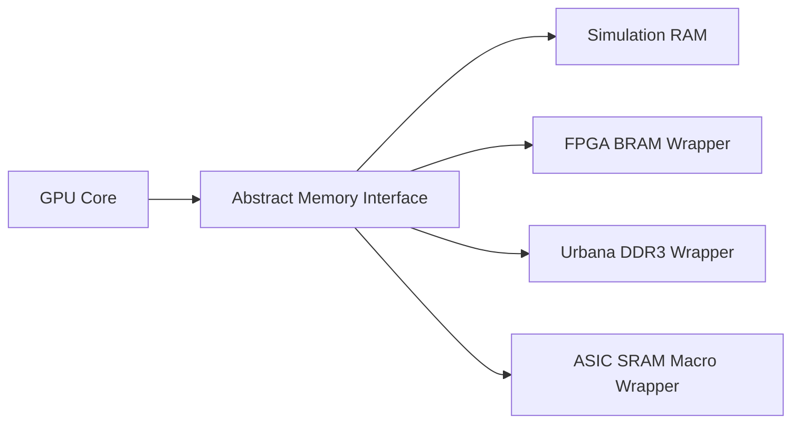

# SRAM Strategy

ASIC-oriented memory must be explicit. Large inferred memories are acceptable
for FPGA and simulation experiments, but ASIC implementation should use SRAM
macro wrappers.

## Memory Boundary



## Rule

Portable draw units do not instantiate memories directly unless they are small
register arrays that are intentionally part of logic. Framebuffer and resource
storage goes behind wrappers.

## Version 1

Version 1 may use:

- simulation RAM in `platform/sim/`
- inferred memory or BRAM wrapper in `platform/urbana/`

The same abstract memory interface should be used in both cases.

## ASIC Experiment

An ASIC experiment should replace framebuffer storage with an SRAM wrapper:

```text
platform/asic/sram_wrapper_stub.sv
```

The wrapper should model:

- read latency
- write mask behavior
- chip enable
- write enable
- address width
- data width

## Open Decisions

| Decision | Options |
| --- | --- |
| SRAM data width | 32-bit, 64-bit, or macro-native width. |
| Read latency | 1 cycle, 2 cycles, or wrapper-configurable. |
| Byte masking | native byte mask or read-modify-write wrapper. |
| Memory banking | single bank first, multi-bank later. |
| Line buffer | no line buffer, scanout FIFO, or full line buffer. |

## Verification Impact

Memory wrappers need tests for:

- masked writes
- read-after-write behavior
- out-of-range protection in simulation
- latency alignment
- backpressure
- scanout underflow behavior
