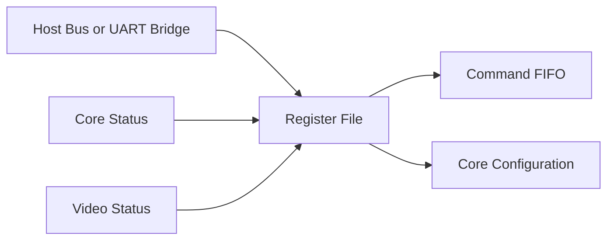

# Memory Map

The register file exposes a small memory-mapped control and status interface.
Addresses are byte offsets from the GPU register base.

## Register Summary

| Offset | Name | Access | Reset | Description |
| ---: | --- | --- | ---: | --- |
| `0x0000` | `GPU_ID` | RO | implementation | Identifies this core. |
| `0x0004` | `GPU_VERSION` | RO | implementation | Encoded major/minor/patch version. |
| `0x0008` | `STATUS` | RO | `0x00000001` | Idle, busy, FIFO, and error status. |
| `0x000C` | `CONTROL` | RW | `0x00000000` | Enable, soft reset request, interrupt control. |
| `0x0010` | `FRAMEBUFFER_BASE` | RW | `0x00000000` | Base byte address for framebuffer. |
| `0x0014` | `FRAMEBUFFER_WIDTH` | RW | `160` | Active framebuffer width in pixels. |
| `0x0018` | `FRAMEBUFFER_HEIGHT` | RW | `120` | Active framebuffer height in pixels. |
| `0x001C` | `FRAMEBUFFER_FORMAT` | RW | `1` | Pixel format selector. |
| `0x0020` | `COMMAND_FIFO_WRITE` | WO | n/a | Push one command word. |
| `0x0024` | `INTERRUPT_STATUS` | RW1C | `0` | Sticky interrupt causes. |
| `0x0028` | `INTERRUPT_ENABLE` | RW | `0` | Interrupt mask. |
| `0x002C` | `CLIP_XY_MIN` | RW | `0` | Future clip rectangle min coordinate. |
| `0x0030` | `CLIP_XY_MAX` | RW | packed size | Future clip rectangle max coordinate. |

## STATUS Bits

| Bit | Name | Meaning |
| ---: | --- | --- |
| 0 | `IDLE` | No active command or draw operation. |
| 1 | `BUSY` | Command processor or draw unit active. |
| 2 | `FIFO_EMPTY` | Command FIFO is empty. |
| 3 | `FIFO_FULL` | Command FIFO cannot accept another word. |
| 4 | `ERROR` | At least one sticky error is set. |
| 5 | `SCANOUT_ACTIVE` | Video scanout is in active display region. |
| 6 | `FRAME_DONE` | A frame boundary has occurred. |

## CONTROL Bits

| Bit | Name | Meaning |
| ---: | --- | --- |
| 0 | `ENABLE` | Enables command execution. |
| 1 | `SOFT_RESET` | Requests internal reset of command and draw state. |
| 2 | `CLEAR_ERRORS` | Clears sticky error state when written as 1. |
| 3 | `INTERRUPT_ENABLE_GLOBAL` | Allows enabled interrupts to propagate. |
| 4 | `TEST_PATTERN_ENABLE` | Selects platform/core test pattern output. |

## Pixel Formats

| Value | Name | Description |
| ---: | --- | --- |
| 0 | `INVALID` | Not a valid rendering mode. |
| 1 | `RGB565` | 16-bit color, first supported format. |
| 2 | `INDEX8` | Future 8-bit palette-indexed mode. |

## Access Diagram

## Register Design Notes

- All registers are 32 bits.
- Reserved bits read as zero.
- Writes to reserved bits are ignored unless strict validation is enabled.
- `COMMAND_FIFO_WRITE` must apply backpressure or report overflow.
- `FRAMEBUFFER_WIDTH` and `FRAMEBUFFER_HEIGHT` should be validated before use.
