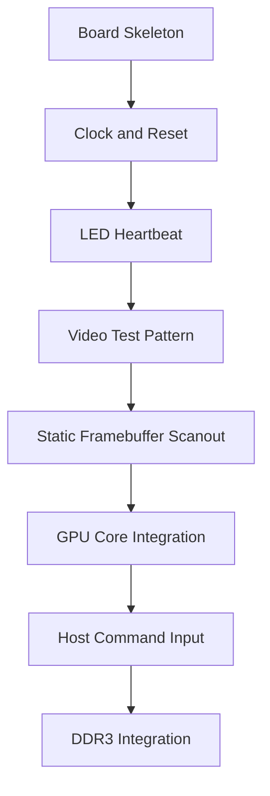

# FPGA Bring-Up

FPGA bring-up is staged so hardware problems are isolated before the GPU core is
connected.

Before claiming an FPGA integration milestone, run the optional Vivado synthesis
smoke:

```text
VIVADO_PART=<xilinx-part-name> make synth-vivado
```

This only checks that the portable programmable core path can be parsed and
synthesized by Vivado for the selected part. Board wrappers, clocks,
constraints, bitstream generation, and timing closure remain separate bring-up
steps.

Without Vivado installed, validate the source manifest and Tcl invocation path
with:

```text
VIVADO_DRY_RUN=1 VIVADO_PART=<xilinx-part-name> make synth-vivado
```

The dry run does not synthesize RTL. It only checks script inputs and source
file paths, and is covered by `make test-tools`.

## Bring-Up Sequence



## Step 1: Board Skeleton

Create `platform/urbana/urbana_top.sv` with:

- board clock input
- reset input
- LED outputs
- unused outputs tied safely
- no GPU core dependency yet

Success condition: bitstream builds and programs.

## Step 2: Clock and Reset

Add:

- `urbana_clocking.sv`
- `urbana_reset.sv`

Success condition: clean synchronized reset and a visible heartbeat counter.

## Step 3: Video Output

Use the portable `video_timing` leaf for active-area coordinates and sync
signals, then feed `video_test_pattern` to display deterministic output without
framebuffer memory. Route pattern output through `video_stream_mux` so the same
platform sink can later switch to framebuffer scanout without changing timing:

- solid color
- bars
- checkerboard
- coordinate gradient

Success condition: stable display with expected geometry.

## Step 4: Framebuffer Scanout

Connect the portable `video_controller` wrapper to a small BRAM or inferred
framebuffer initialized by logic. The wrapper composes `video_timing`,
`framebuffer_scanout`, `video_pixel_fifo`, `video_framebuffer_source`,
`video_test_pattern`, and `video_stream_mux` so the platform can select pattern
or framebuffer output, absorb bounded memory latency, and detect active-pixel
underruns or scanout/timing coordinate mismatches.

`source_select` only selects the output stream. Platform control logic still
owns when to start framebuffer scanout and when to flush the pixel FIFO during
mode changes.

For simulation, `platform/sim/video_controller_system.sv` wraps the controller
with round-robin memory arbitration, a host framebuffer preload port, and
`data_memory`. FPGA wrappers should keep the same external control/video
shape while replacing the simulation memory with board BRAM or DDR-backed
memory.

Success condition: framebuffer image appears and scaling is correct.

## Step 5: GPU Core Integration

Connect:

- command processor
- clear engine
- rectangle engine
- framebuffer writer
- scanout reader

Use a built-in command stream first. UART can wait.

Success condition: hardware command stream clears the frame and draws
rectangles.

## Step 6: Host Command Input

Add UART or another simple host bridge.

Initial host flow:

1. write framebuffer registers
2. write CLEAR command
3. wait for idle
4. write FILL_RECT command
5. wait for idle
6. read status

Success condition: host commands visibly update the display.

## Step 7: DDR3

Only add DDR3 after BRAM framebuffer operation is stable.

DDR3 wrapper requirements:

- same abstract memory interface
- initialization done status
- backpressure support
- clock-domain crossing if controller clock differs
- clear debug state for calibration failures

## Bring-Up Log

Record hardware observations in [../../notes/bringup_log.md](../../notes/bringup_log.md).
