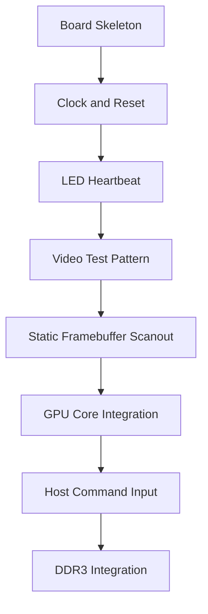

# FPGA Bring-Up

FPGA bring-up is staged so hardware problems are isolated before the GPU core is
connected.

## Bring-Up Sequence

## Step 1: Board Skeleton

Create `platform/urbana/urbana_top.sv` with:

- board clock input
- reset input
- LED outputs
- unused outputs tied safely
- no GPU core dependency yet

Success condition: bitstream builds and programs.

## Step 2: Clock and Reset

Add:

- `urbana_clocking.sv`
- `urbana_reset.sv`

Success condition: clean synchronized reset and a visible heartbeat counter.

## Step 3: Video Output

Display test patterns without framebuffer memory:

- solid color
- bars
- checkerboard
- moving square

Success condition: stable display with expected geometry.

## Step 4: Framebuffer Scanout

Connect scanout to a small BRAM or inferred framebuffer initialized by logic.

Success condition: framebuffer image appears and scaling is correct.

## Step 5: GPU Core Integration

Connect:

- command processor
- clear engine
- rectangle engine
- framebuffer writer
- scanout reader

Use a built-in command stream first. UART can wait.

Success condition: hardware command stream clears the frame and draws
rectangles.

## Step 6: Host Command Input

Add UART or another simple host bridge.

Initial host flow:

1. write framebuffer registers
2. write CLEAR command
3. wait for idle
4. write FILL_RECT command
5. wait for idle
6. read status

Success condition: host commands visibly update the display.

## Step 7: DDR3

Only add DDR3 after BRAM framebuffer operation is stable.

DDR3 wrapper requirements:

- same abstract memory interface
- initialization done status
- backpressure support
- clock-domain crossing if controller clock differs
- clear debug state for calibration failures

## Bring-Up Log

Record hardware observations in [../../notes/bringup_log.md](../../notes/bringup_log.md).
