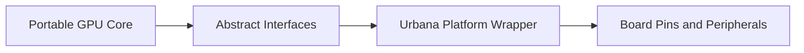

# Target Platform: RealDigital Urbana

The initial development board is the RealDigital Urbana FPGA board.

Project assumptions from the provided board reference:

- AMD/Xilinx Spartan-7 FPGA
- 128 MB DDR3 memory
- video output
- USB/UART programming and communication path
- buttons, switches, LEDs, and general I/O

Reference: [RealDigital Urbana board](https://www.realdigital.org/hardware/urbana)

## Why Urbana Is a Good First Target

Urbana has enough resources to exercise real hardware graphics design without
forcing the GPU core to depend on board-specific logic.

The useful hardware features map cleanly onto this project:

| Board Feature | Project Use |
| --- | --- |
| Spartan-7 FPGA | Synthesizes the custom GPU RTL. |
| DDR3 memory | Later external framebuffer and resource storage. |
| Video output | Hardware-visible proof that pixels are correct. |
| UART or USB bridge | Host command stream for demos and bring-up. |
| Switches and buttons | Debug controls and simple mode selection. |
| LEDs | Early status, heartbeat, and error indicators. |

## Platform Role

The Urbana board is not the GPU architecture. It is a replaceable platform
wrapper around the GPU core.

## Version 1 Usage

Version 1 should use the smallest amount of board support needed to make pixels
visible:

1. clock and reset
2. status LEDs
3. video test pattern
4. small framebuffer in BRAM or inferred memory
5. GPU clear and rectangle commands

DDR3 should wait until BRAM framebuffer scanout is working.

## Board-Specific Risk Register

| Risk | Mitigation |
| --- | --- |
| Video pinout or timing differs from assumptions | Keep video wrapper isolated and document timing mode. |
| DDR3 controller integration dominates early work | Defer DDR3 until BRAM framebuffer version works. |
| Clocking resources require vendor IP | Isolate PLL/MMCM in `platform/urbana/urbana_clocking.sv`. |
| Host command input takes longer than expected | Start with built-in command ROM or simulation command source. |
| Constraint file is incomplete | Bring up LEDs and video patterns before integrating the GPU. |
