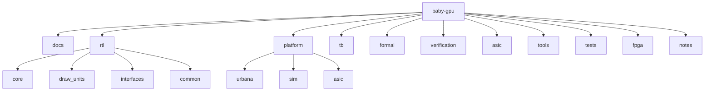

# Repository Structure

The repository layout is designed to make the architecture boundary visible in
the filesystem.

```text
baby-gpu/
  README.md
  docs/
  rtl/
  platform/
  tb/
  formal/
  verification/
  asic/
  tools/
  tests/
  fpga/
  notes/
```

## Source Layout



## Directory Responsibilities

| Directory | Contents |
| --- | --- |
| `docs/` | Design documents, specifications, and implementation plans. |
| `rtl/core/` | Portable top-level GPU modules. |
| `rtl/draw_units/` | Clear, rectangle, line, sprite, tile, and triangle units. |
| `rtl/interfaces/` | Shared interface definitions and protocol documentation. |
| `rtl/common/` | Reusable RTL such as FIFOs, buffers, fixed-point helpers, and reset sync. |
| `platform/urbana/` | Urbana-specific top, clocking, reset, video, memory, UART, and constraints. |
| `platform/sim/` | Simulation-only memory, video sink, and command source models. |
| `platform/asic/` | Placeholder wrappers for SRAM, PLL, pads, and future ASIC integration. |
| `tb/unit/` | Unit testbenches for individual modules. |
| `tb/integration/` | Full-core and framebuffer render tests. |
| `formal/properties/` | Reusable SystemVerilog assertions and assumptions. |
| `formal/harnesses/` | Module-specific formal harnesses. |
| `formal/scripts/` | SymbiYosys or formal tool launch scripts. |
| `verification/` | Regression manifests, coverage plans, and generated reports. |
| `asic/constraints/` | SDC and ASIC timing constraints. |
| `asic/openroad/` | OpenROAD or OpenLane physical-design experiments. |
| `asic/reports/` | Synthesis, timing, area, power, LEC, and signoff reports. |
| `asic/scripts/` | ASIC flow scripts. |
| `tools/scripts/` | Build, simulation, lint, and formatting scripts. |
| `tools/generators/` | Test image, sprite ROM, and command stream generators. |
| `tests/` | Command streams, expected frames, and generated frames. |
| `fpga/vivado/` | Vivado project creation scripts. |
| `notes/` | Bring-up logs, debug logs, and design decisions. |

## File Naming Rules

- SystemVerilog modules use lowercase snake case.
- Testbenches start with `tb_`.
- Platform wrappers include the platform name, for example `urbana_video_out.sv`.
- Documents use one topic per Markdown file.

## Empty Directory Tracking

Scaffold directories contain `.gitkeep` files until real sources are added.
