# Roadmap

The roadmap keeps the project small enough to finish while leaving a clear path
to more capable graphics hardware.

## Phase Diagram

```mermaid
gantt
  title UrbanaGPU Development Phases
  dateFormat X
  axisFormat %s
  section Foundation
  Scaffold and docs           :0, 1
  Coding style and interfaces :1, 1
  FIFO and command processor  :2, 2
  section Version 1
  Clear engine                :4, 1
  Rect fill engine            :5, 1
  Framebuffer scanout         :6, 2
  Urbana video bring-up       :8, 2
  section Expansion
  UART command input          :10, 2
  Line engine                 :12, 2
  Sprite engine               :14, 3
  Tile engine                 :17, 3
  Triangle rasterizer         :20, 4
  DDR3 framebuffer            :24, 4
```

## Version 1

- repository scaffold
- documentation
- FIFO
- command processor skeleton
- simulation memory
- clear engine
- rectangle fill engine
- simple scanout
- Urbana video output

## Version 2

- UART command input
- improved register access
- line engine
- stronger golden image tests
- better error reporting

## Version 3

- sprite blitting
- tilemap background
- palette support
- frame pacing
- double buffering

## Version 4

- memory arbiter improvements
- DDR3 framebuffer
- burst reads and writes
- scanout line buffer

## Version 5

- flat-shaded triangle rasterizer
- depth buffer experiment
- fixed-point interpolation
- ASIC wrapper stubs and lint flow

## Stretch Goals

- command DMA
- interrupts
- texture fetch
- small programmable arithmetic stage
- software driver library
- demo scene or simple game
- formal verification for FIFOs and arbiters
- OpenROAD ASIC synthesis experiment
