# Roadmap

The roadmap keeps the project small enough to finish while leaving a clear path
to more capable graphics hardware.

## Phase Diagram

```mermaid
gantt
  title UrbanaGPU Development Lanes
  dateFormat X
  axisFormat %s
  section Foundation
  Scaffold and docs           :0, 1
  Coding style and interfaces :1, 1
  FIFO and command processor  :2, 2
  section Formal
  FIFO and valid-ready proofs :2, 2
  Clear and rect proofs       :4, 3
  Writer and arbiter proofs   :7, 3
  section Version 1
  Clear engine                :4, 1
  Rect fill engine            :5, 1
  Framebuffer scanout         :6, 2
  Urbana video bring-up       :8, 2
  section ASIC Prep
  ASIC lint baseline          :6, 2
  SDC and SRAM wrappers       :8, 3
  Generic synthesis and LEC   :11, 3
  section Expansion
  UART command input          :14, 2
  Line engine                 :16, 2
  Sprite engine               :18, 3
  Tile engine                 :21, 3
  Triangle rasterizer         :24, 4
  DDR3 framebuffer            :28, 4
```

## Version 1

- repository scaffold
- documentation
- design decision log
- FIFO
- command processor skeleton
- simulation memory
- clear engine
- rectangle fill engine
- simple scanout
- Urbana video output
- first formal property library
- FIFO proof
- clear and rectangle safety proof targets

## Version 2

- UART command input
- improved register access
- line engine
- stronger golden image tests
- better error reporting

## Version 3

- sprite blitting
- tilemap background
- palette support
- frame pacing
- double buffering

## Version 4

- memory arbiter improvements
- DDR3 framebuffer
- burst reads and writes
- scanout line buffer

## Version 5

- flat-shaded triangle rasterizer
- depth buffer experiment
- fixed-point interpolation
- ASIC wrapper stubs
- lint flow
- generic synthesis
- RTL-to-gate equivalence check

## ASIC Hardening Lane

The ASIC lane is deliberately parallel to the FPGA lane.

| Milestone | Goal |
| --- | --- |
| ASIC lint baseline | Catch structural RTL issues before integration grows. |
| SDC skeleton | Ensure clocks, I/O timing, and exceptions are documented. |
| SRAM wrapper strategy | Avoid accidental flip-flop framebuffers in ASIC experiments. |
| Generic synthesis | Prove RTL is synthesizable outside Vivado. |
| LEC experiment | Compare synthesized gates against RTL. |
| OpenROAD/OpenLane experiment | Harden a small GPU-core subset after Version 1 stabilizes. |
| Signoff checklist | Track STA, DRC, LVS, antenna, IR, EM, and gate-level sim expectations. |

## Stretch Goals

- command DMA
- interrupts
- texture fetch
- small programmable arithmetic stage
- software driver library
- demo scene or simple game
- formal verification for FIFOs and arbiters
- OpenROAD ASIC synthesis experiment
