# Roadmap

The roadmap now follows one architecture: a unified programmable tiny GPU.
Intermediate milestones are implementation steps, not separate product
versions. Avoid building a fixed-function graphics accelerator and later
rewriting it into a programmable GPU.

## Phase Diagram

```mermaid
gantt
  title UrbanaGPU Programmable Architecture Roadmap
  dateFormat X
  axisFormat %s
  section Foundation
  Project scaffold and toolchain      :0, 1
  Command FIFO and register file      :1, 1
  Fixed-function smoke path           :2, 1
  Architecture specification          :3, 1
  section Programmable Core
  ISA encoding                        :4, 1
  Lane register file                  :5, 1
  SIMD ALU                            :6, 1
  Instruction fetch and decode        :7, 2
  Scheduler 1 core x 4 lanes          :9, 2
  Blocking load-store unit            :11, 2
  section Kernel Tests
  vector_add                          :13, 2
  STORE16 and framebuffer writes      :15, 1
  framebuffer_gradient                :16, 2
  bounded fill kernel                 :18, 2
  section Platform
  Simulation RAM                      :10, 2
  Video scanout from global memory    :16, 2
  Urbana framebuffer display          :18, 3
  section Signoff Discipline
  Block formal proofs                 :7, 8
  Open-source synthesis smoke         :10, 6
  Vivado synthesis smoke              :14, 6
  Timing and constraints              :16, 8
  section Scaling
  Scratchpad experiment               :21, 3
  Multi-core memory IDs               :24, 2
  More lanes per core                 :26, 2
  Cache experiment                    :28, 4
```



## Completed Foundation

- repository scaffold
- documentation scaffold
- native RTL toolchain checks
- command FIFO
- command processor
- register file
- clear and rectangle fixed-function smoke engines
- framebuffer writer
- RTL simulation runner
- lint configuration

These blocks are now infrastructure for the programmable GPU, not the whole
architecture.

## Current Architecture Milestone

Document the programmable model before writing more core RTL:

- [programming_model.md](programming_model.md)
- [isa.md](isa.md)
- [core_architecture.md](core_architecture.md)
- [memory_model.md](memory_model.md)
- [kernel_execution.md](kernel_execution.md)

Exit criteria:

- initial lane/core shape is explicit
- initial kernel set is explicit
- ISA envelope is explicit
- memory hierarchy sequence is explicit
- fixed-function blocks have a defined long-term role

## Next RTL Milestone: Minimal Programmable Core

Required blocks:

| Block | Purpose |
| --- | --- |
| Lane register file | Private registers per SIMD lane. |
| SIMD ALU | Execute integer ops across lanes. |
| Instruction memory model | Feed encoded test programs in simulation. |
| Decoder/control | Execute the base instruction subset. |
| Scheduler | Assign 2D work-items to four lanes. |
| Blocking LSU | Run simple global loads and stores. |

Initial instruction subset:

```text
NOP
END
MOVI / CONST
MOVSR
ADD
MUL
LOAD
STORE
```

Branching and predicates can wait until `vector_add` works.

Verification gates for this milestone:

- unit simulation for each leaf block
- integration simulation for basic programs
- formal plan or proof for decoder, register file, scheduler, and LSU
- lint clean
- open-source synthesis smoke target tracked
- Vivado synthesis smoke target before FPGA platform claims

## First Kernel Milestone: `vector_add`

Goal:

```text
C[i] = A[i] + B[i]
```

Proves:

- kernel launch
- global ID generation
- special register reads
- address arithmetic
- global loads
- ALU add
- global stores
- tail-lane handling

Exit criteria:

- deterministic RTL simulation
- initialized memory fixture
- expected output comparison
- timeout on hang
- zero sticky errors

## Second Kernel Milestone: `framebuffer_gradient`

Goal:

```text
framebuffer[y][x] = rgb565(x, y, constant)
```

Proves:

- 2D IDs
- RGB565 packing
- `STORE16`
- framebuffer memory convention
- golden framebuffer comparison

Exit criteria:

- memory comparison passes
- optional generated image artifact
- no fixed-function pixel writer required

## Third Kernel Milestone: Bounded Fill

Goal:

```text
if pixel inside rectangle:
  store color
```

This milestone should force a decision about predication or branch divergence.
Do not quietly add full SIMT masks without documenting and testing them.

Acceptable approaches:

- implement predicated store
- restrict the first fill kernel to convergent control
- defer rectangle fill until mask support exists

## Scaling Lane

Scaling is deliberately staged:

1. single core, four lanes
2. more lanes per core
3. per-core scratchpad
4. memory request IDs
5. multiple cores
6. read-only or instruction cache
7. data cache
8. divergence masks and reconvergence

Do not add caches before the blocking memory model is correct. Do not add
multiple cores before memory responses have routing identity.

## ASIC and FPGA Lane

The programmable architecture must remain portable:

- no vendor primitives inside core RTL
- inferred or wrapped memories only
- synchronous reset policy remains explicit
- one clock domain until simulation and FPGA bring-up justify more
- ASIC SRAM wrappers kept separate from FPGA BRAM wrappers

Platform work should not define the core programming model.

## Stretch Goals

Stretch goals are valid only after the first programmable kernels pass:

- assembler
- waveform/debug trace tooling
- scratchpad memory
- predicated execution
- divergent branch masks
- UART command input
- video scanout with double buffering
- DDR3 global memory wrapper
- simple instruction cache
- simple data cache
- multi-core dispatch
