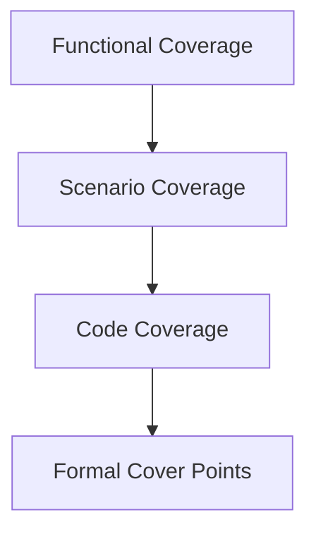

# Coverage Plan

Coverage defines what must be observed before a test suite is trusted. It is
not a replacement for assertions or golden frames.

## Coverage Layers



## Functional Coverage

Track whether important behaviors occurred:

- each command opcode decoded
- each command error path triggered
- clear engine completed at least one full frame
- rectangle engine rendered inside, clipped, and no-op rectangles
- framebuffer writer exercised low and high RGB565 byte lanes
- memory arbiter granted every client
- scanout crossed frame boundaries

## Scenario Coverage

Required Version 1 scenarios:

| Scenario | Expected Observation |
| --- | --- |
| Clear only | Whole framebuffer matches one color. |
| Single rectangle | Rectangle bounds match command. |
| Overlapping rectangles | Later commands overwrite earlier pixels. |
| Clipped rectangle | Only visible pixels change. |
| WAIT_IDLE | Command stream stalls until writes drain. |
| Malformed command | Sticky error bit set, no illegal writes. |
| Programmable branch control | Convergent taken/not-taken branches, signed backward offsets, R0 never-taken predicates, and divergent faults are observed. |
| Predicated memory no-op | R0-predicated `PSTORE` completes without memory requests and leaves memory unchanged. |

## Code Coverage

If the simulator supports it, collect:

- line coverage
- branch coverage
- toggle coverage for control-heavy modules
- FSM state coverage

Code coverage should be interpreted with care. High code coverage does not mean
the graphics behavior is correct.

## Formal Cover Points

Formal cover goals should prove reachability:

- FIFO full and empty
- clear engine final pixel
- rectangle edge clipping
- command processor malformed command state
- arbiter grants each input

## Coverage Reports

Planned directory:

```text
verification/
  coverage/
  regressions/
  directed_tests/
  random_tests/
```

Coverage results should be checked into reports only when they document a
release or meaningful milestone. Generated simulator databases should not be
committed by default.
