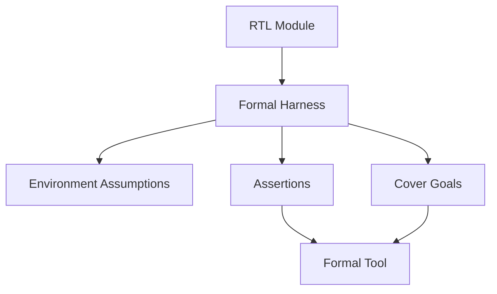

# Formal Verification Plan

Formal verification is a parallel lane for proving control, protocol, and
addressing properties. It should start with small reusable blocks and expand
only after the RTL interfaces are stable.

## Scope

Formal is best suited for:

- FIFOs
- skid buffers
- valid/ready protocol blocks
- command packet parsing
- framebuffer address generation
- memory arbitration
- draw-unit termination and bounds safety

Formal is not the only verification method. Image correctness, video output,
and command-stream behavior still need simulation and hardware tests.

## Property Categories

| Category | Meaning | Example |
| --- | --- | --- |
| Safety | Bad states never happen. | FIFO never pops when empty. |
| Liveness | Progress eventually happens under assumptions. | A started clear eventually completes if memory is ready often enough. |
| Protocol | Interfaces obey handshake rules. | Payload is stable while `valid && !ready`. |
| Reset | Reset reaches known safe state. | No memory write is active after reset. |
| Bounds | Addresses and coordinates stay legal. | Rectangle fill never writes outside framebuffer bounds. |
| Ordering | Sequence is preserved. | FIFO outputs data in push order. |

## Formal Architecture



## Initial Proof Targets

| Block | Proof Goals |
| --- | --- |
| `command_fifo.sv` | no overflow/underflow and valid reset/protocol behavior. |
| `simd_alu.sv` | lane-wise arithmetic and logical operation correctness. |
| `framebuffer_writer.sv` | correct address math and byte masks. |
| `work_scheduler.sv` | launch sequencing, active masks, tail handling, and progress. |
| `instruction_decoder.sv` | field extraction plus high-risk CMP/PSTORE/unknown-opcode decode contracts. |
| `lane_register_file.sv` | R0 hardwiring, lane isolation, write enables, and multi-read behavior. |
| `load_store_unit.sv` | request sequencing, alignment errors, byte masks, and response routing. |
| `data_memory.sv` | byte-mask writes, read-after-write behavior, and out-of-range errors. |

## Directory Plan

```text
formal/
  harnesses/
    command_fifo_formal.sv
    framebuffer_writer_formal.sv
    instruction_decoder_formal.sv
    lane_register_file_formal.sv
    simd_alu_formal.sv
    work_scheduler_formal.sv
  scripts/
    run_sby.sh
    command_fifo.sby
    framebuffer_writer.sby
    instruction_decoder.sby
    lane_register_file.sby
    simd_alu.sby
    work_scheduler.sby
```

## Open-Source Tool Path

Recommended starting stack:

```text
Yosys
SymbiYosys
smtbmc
Boolector, Z3, or Yices
```

This is sufficient for serious block-level proofs. Commercial formal tools can
be introduced later if available.

## Assumption Discipline

Every assumption must represent the environment, not hide a design bug.

Examples of acceptable assumptions:

- reset is asserted at the beginning of a proof
- framebuffer width and height are nonzero and within parameter bounds
- downstream `ready` is asserted infinitely often for liveness proofs
- command FIFO delivers stable data while valid and not ready

Examples of risky assumptions:

- memory is always ready
- no malformed commands arrive
- coordinates are always in range
- start never occurs while busy unless the RTL enforces that externally

## Coverage Goals

Formal cover statements should show that important states are reachable:

- FIFO fills and drains
- clear engine completes a multi-row frame
- rectangle engine clips on right and bottom edges
- command processor detects an illegal opcode
- arbiter grants each client

## Exit Criteria

Initial formal adoption is already active when:

- `rtk err make formal` runs all committed SymbiYosys jobs
- FIFO proof passes
- SIMD ALU proof passes
- framebuffer writer address and mask proof passes
- work scheduler proof passes
- instruction decoder smoke proof passes

Next exit criteria:

- lane register file proof
- LSU proof
- simulation data memory proof
- programmable-core bounded safety properties where practical
- bounded proof runtimes suitable for the normal local gate
