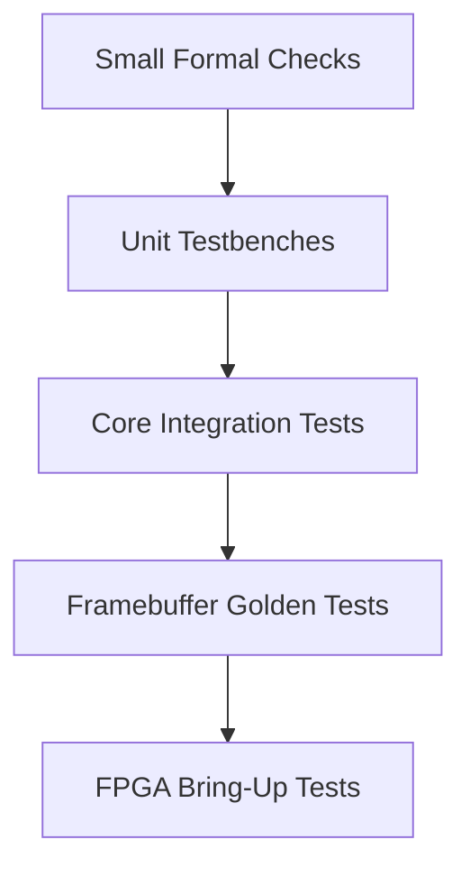
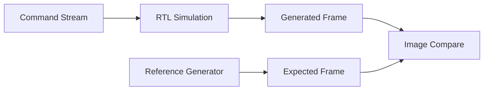

# Verification Plan

Verification starts before FPGA bring-up. Every major module should have a
simulation path and a small set of targeted tests.

Formal verification and coverage are first-class verification activities. This
document describes the whole verification stack; detailed proof planning lives
in [formal_verification.md](formal_verification.md), and coverage planning lives
in [coverage_plan.md](coverage_plan.md).

## Verification Pyramid



## Unit Tests

| Module | Required Tests |
| --- | --- |
| FIFO | reset, fill, empty, full, simultaneous push/pop, overflow protection. |
| Command processor | valid packets, unknown opcode, wrong length, WAIT_IDLE. |
| Register file | reset values, read/write behavior, reserved bits, sticky errors. |
| Clear engine | full frame, small frame, backpressure, reset during operation. |
| Rect engine | inside bounds, partial clipping, full clipping, zero dimensions. |
| Framebuffer writer | address calculation, byte masks, write handshake stability. |
| Memory arbiter | simultaneous clients, priority behavior, no dropped requests. |
| Video scanout | coordinate generation, scale mapping, frame boundary pulses. |

## Integration Tests

Integration tests run the full portable core with:

- simulation command source
- simulation memory
- simulation video sink

Minimum command streams:

1. clear black
2. clear solid color
3. one centered rectangle
4. overlapping rectangles
5. clipped rectangles on each edge
6. WAIT_IDLE after each draw
7. malformed command error path

## Golden Frame Tests

Golden tests compare generated framebuffer contents against expected images.



Expected data lives under:

```text
tests/command_streams/
tests/expected_frames/
tests/generated_frames/
```

## Assertions

Add simple assertions for protocol mistakes:

- request payload stable while `valid && !ready`
- no FIFO pop when empty
- no FIFO push when full unless simultaneous pop allows it
- draw unit `done` only follows an accepted `start`
- memory write mask is nonzero for writes

## Formal Verification Lane

Initial formal targets:

- FIFO ordering, overflow, and underflow safety
- valid/ready payload stability
- clear engine termination under fair backpressure
- rectangle fill bounds safety
- framebuffer writer address and write-mask correctness
- memory arbiter one-hot grants and no dropped accepted request

Formal is not a replacement for framebuffer golden tests. It proves local
properties that are difficult to cover exhaustively with simulation.

## ASIC-Oriented Verification

ASIC-style verification adds:

- lint with waiver discipline
- clock/reset structural checks
- CDC checks when multiple clocks are introduced
- synthesis smoke tests outside Vivado
- RTL-to-gate equivalence checks
- timing constraint checks for unconstrained paths

The first ASIC-oriented milestone is a clean lint and generic synthesis run for
the portable core, not a complete physical layout.

## FPGA Validation

FPGA tests should be observable with minimal tooling:

- LED heartbeat
- LED error indicator
- video test pattern
- static framebuffer
- clear command result
- rectangle command result
- UART command smoke test

## Exit Criteria for Version 1

Version 1 verification is acceptable when:

- clear and rectangle unit tests pass
- core integration command streams pass
- generated frames match golden frames
- basic lint flow has no intentional latch warnings
- Urbana board displays the expected framebuffer result
