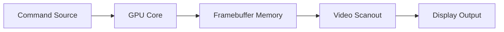

# Version 1 Scope: UrbanaGPU-1

Version 1 proves the full loop from command input to visible pixels.

## Functional Goal

The GPU can:

- accept a small command stream
- clear a framebuffer
- draw filled rectangles
- display the framebuffer over video output
- run the same core in simulation and on Urbana

## Required Commands

```text
CLEAR color
FILL_RECT x y width height color
WAIT_IDLE
```

## Required Render Target

```text
internal: 160x120 RGB565
output: 640x480
scale: 4x
```

## Minimal System Diagram



## In Scope

- portable command processor
- register file
- command FIFO
- clear engine
- rectangle fill engine
- framebuffer writer
- simple memory arbiter
- simulation memory
- simulation video sink
- Urbana top-level wrapper
- Urbana video wrapper
- design documentation
- unit and integration testbench scaffolding

## Out of Scope

- DDR3 framebuffer
- sprites
- tilemaps
- line drawing
- triangles
- depth buffer
- texture mapping
- programmable shaders
- multi-clock optimization
- ASIC physical design

## Definition of Done

Version 1 is complete when:

- GPU core is custom RTL
- clear engine works in simulation
- rectangle engine works in simulation
- framebuffer can be displayed on Urbana
- commands can modify the framebuffer
- core has no direct Xilinx primitive instantiations
- Urbana-specific code is isolated under `platform/urbana/`
- architecture, command format, and memory map docs exist
- notes capture bring-up and design decisions

## First Demo

Recommended first visible demo:

1. clear screen to dark background
2. draw a red rectangle
3. draw a green rectangle overlapping it
4. draw a blue rectangle clipped against the right edge
5. wait idle
6. leave image stable on display
